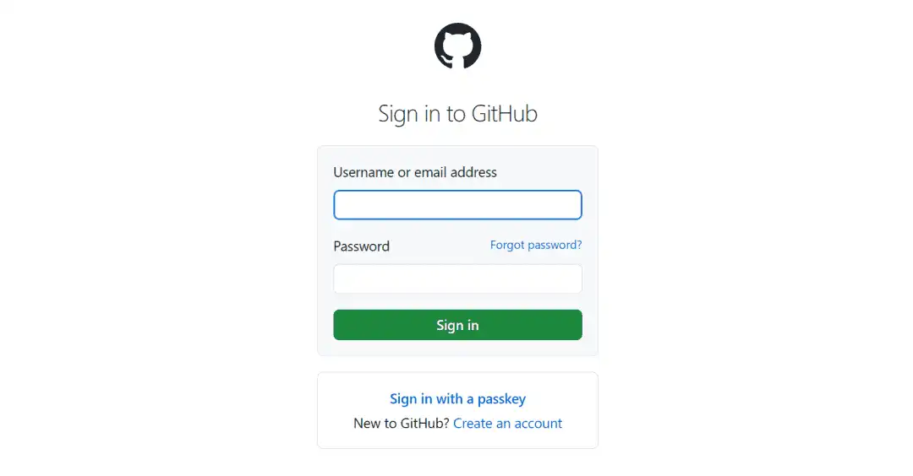
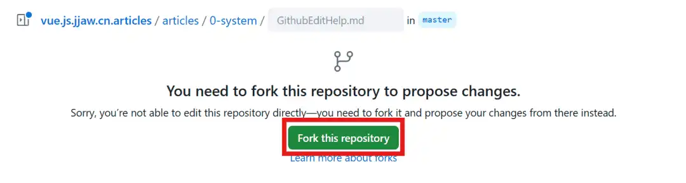
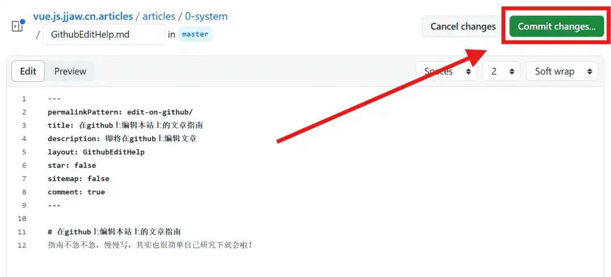
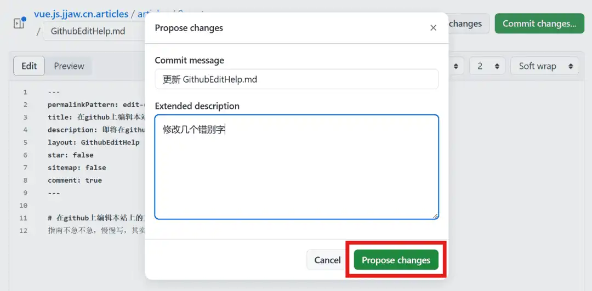
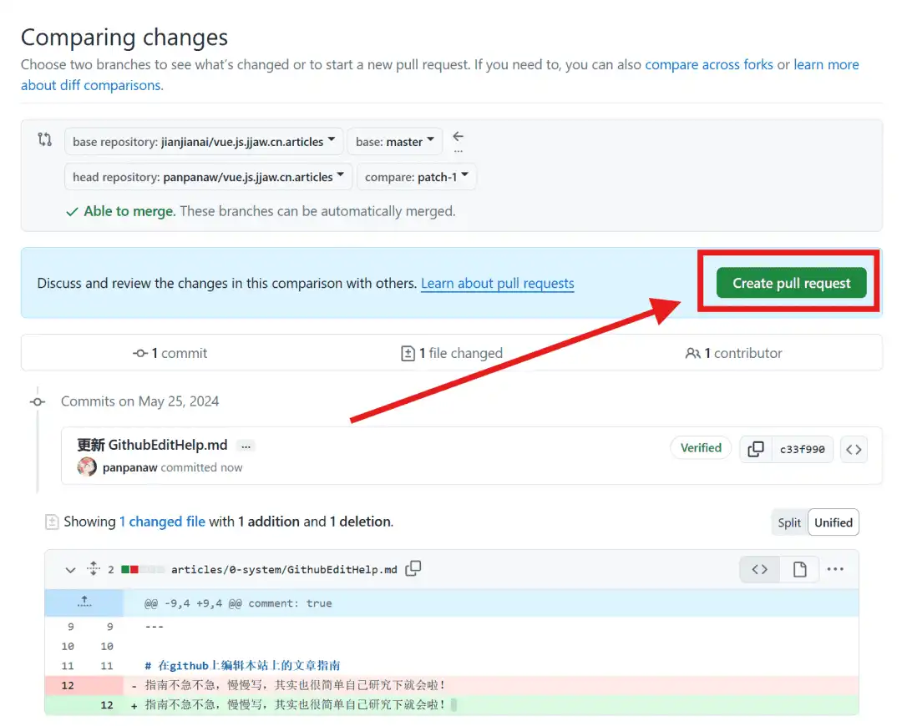
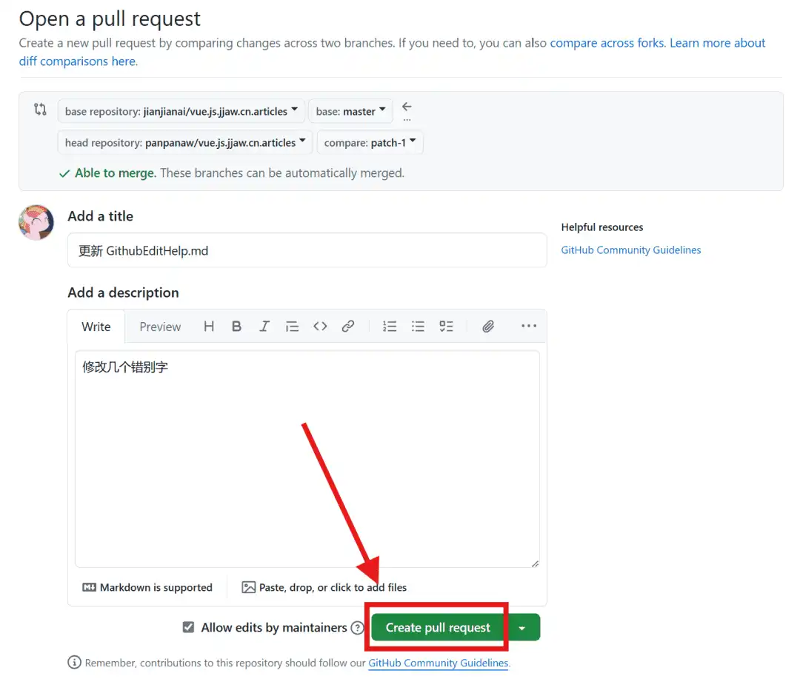

# 在github上编辑本站上的文章指南
## 编辑步骤
### 1.点击`编辑此文章`按钮

### 2.登录GitHub

### 3.点击`Fork this repository`Fork项目仓库

### 4.编辑此文章的内容，编辑完成后点击`Commit changes`提交编辑

### 5.描述修改内的容，完成后点击`Commit changes`提交编辑

### 6.提交完成后点击`Create pull request`创建拉取请求

### 7.编辑拉去请求信息，完成后点击`Create pull request`创建拉取请求

### 8.等待合并更新
完成之后等待一段时间，如果没问题的话就会更新到网站上。
