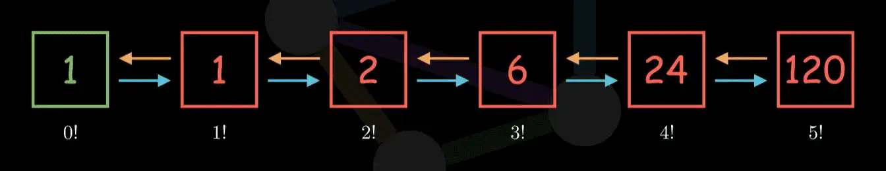
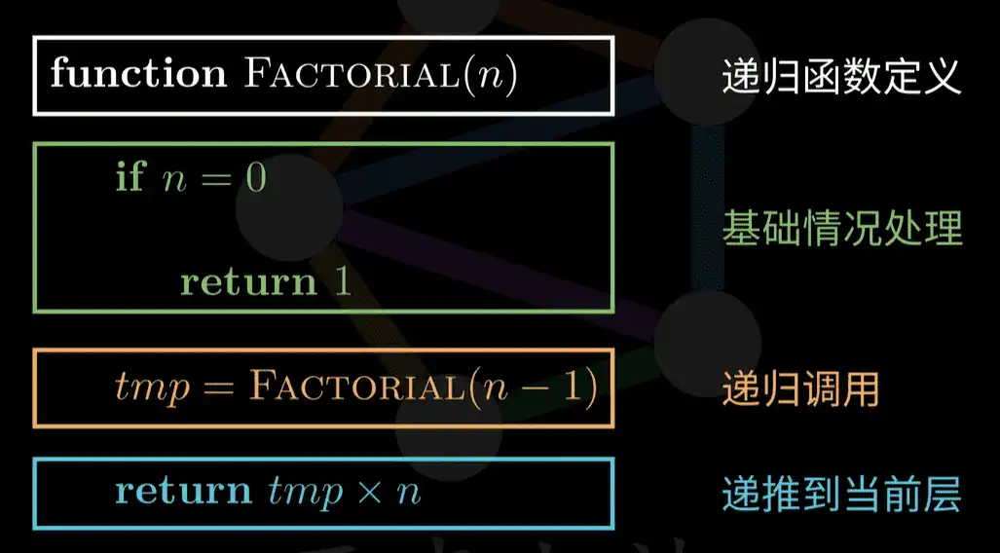

# 我的奇葩蓝桥杯经历

## 经历分享

### 一个有趣的故事
> 大家知道我为什么要去参加蓝桥杯吗？大家可能以为我是想提升自己。
> 其实并不是这样，参加比赛是因为一个很离谱的原因，说出来你们可能不信。

> 之前我们不是在军训吗？军训又是一件非常累的事情，谁想参加呢？
> 之后就听说有蓝桥杯这个活动，还听说参加蓝桥杯可以请假半天？
> 听到这个消息谁不兴奋呢？管他啥活动，只要参加一个就能回寝室躺半天于是就直接参加了。

#### 第一场比赛
> 参加第一场比赛当天我就非常地高兴，因为不用军训。
> 我的想法是随便做几题然后就可以睡觉去了。本以为题目会很难的。
> 当我看到题目时，第一题就惊艳到我了，居然这么简单。
> 你们猜猜是什么题目？

~~~
求 1~2020 的和
~~~

> 这也太简单了吧！其他的题目也都很简单。可能参加的人也不多吧！于是就简简单单轻轻松松晋级了。

#### 啥也不会
> 之后就成功晋级了，老师就让我去报名省赛，记得报名费好像是80块钱吧！ 之后学校帮我报销了。
> 当时就想着不能浪费这80块钱，怎么招也得拿个奖吧！啥奖都行，总之不能太舍人了。
> 当时其实也啥都不会，之前学习的是C++，java对我来说也是一门比较陌生的语言吧！
> 后来就开始认真学习java，不仅上课学习。还看了很多关于java的视频。
> 不过还是觉得就我这水平，去省赛绝对会被吊打吧！心里其实很没底。

#### 紧张刺激又悠闲的省赛
> 不久之后，到了省赛的时间。虽然还是啥都不会，就会点基础，心里还是没底。 但是不得不去了呀。
> 学校对于比赛的安排是真的挺贴心的，因为考虑到比赛4个小时，好像是 上午10点~下午2点 比赛。
> 考虑到比赛的时候可能会饿，还给我们贴心地准备了午餐，在比赛的时候吃。
> 午饭是一盒很精致的三明治。 真的很好吃！ 最重要的是，只有我们学校有！别人学校都没有。
> 可惜了当时没用拍照，不然可以缠缠你们。
> 在考试的时候，别人都在紧张又刺激地答题，我在悠闲又自在地吃我们学校发地精致又美味地三明治！

> 结果就是，我没做完！只做出来了几题。当时回来的时候挺沮丧的，想着早知道就不参加了，这也太舍人了。
> 但是最后的结果居然令人很惊喜，这也能拿一等奖？

#### 总结
> 蓝桥杯对于我们来说并不是高不可攀，其实只要去参加了就有可能拿奖！不过这是在你付出了相应的努力之后。
> 其实我在参加省赛之前也是什么都不会的，正是因为参加了比赛，才有了这份责任感。这份责任感促使我去提升自己。
> 给了我很强的学习动力。所以参加不是去证明自己的能力，而是去提升自己。

## 如何学习，要学习什么？
> 按照我的经验，如果你想参加蓝桥杯省赛会这些就够了。

### 算法
> 我猜大家肯定已经在网速搜索过了，参加蓝桥杯需要掌握这些算法。

- 动态规划
- 贪心
- 排列组合
- 搜索（深度优先/广度优先）
- 分治法
- 回溯法
- 递归
- 暴力枚举
- 高精度加减乘除

> 但是我去参加省赛之后发现，只用到了这几个。
> 
> 所以参加省赛推荐大家先把这四个学好，再去学习其他的算法。
- 排列组合
- 暴力枚举
- 递归
- 高精度加减乘除

#### 基础

##### 暴力枚举
> 暴力枚举这个就不用说了吧，相信大家都会。
> 就举个例子吧

例：
~~~
有两个抽奖箱，每个箱子里都装有1~9编号的小球，每个箱子抽一个小球，两个小球编号相加大于9的可能有哪些。
~~~

> 那么就可以非常暴力，两个for搞定。
> 这个只适合数据量比较小的如果数据量非常的大就不行了。
> 那么相同的问题我们可以用排列组合解决。
> 至于怎么解决你们自己去学哈。
~~~ java
for(int a=1;a<=9;a++){
    for(int b=1;b<=9;b++){
        if(a+b>9){
            System.out.print("a=");
            System.out.print(a);
            System.out.print(" b=");
            System.out.println(b);
        }
    }   
}
~~~

##### 排列组合

> 排列在高中数学课应该都学过吧！我中专都学了，高中肯定学了。
> 所以非常简单，去复习一下就行了。属于是可以直接跳过的了。
> 这里举个例子。

例：
~~~
一共有6门选修课，每个同学可以选2门，一共有7个同学请问有多少种可能。
~~~

> 这样的问题就可以用排列组合来解决，甚至不用写程序。
>
> 一个同学可以选两门课，那么肯定是先选一门，再选另一门。
> 第一门有6种可能，第二门已经选过一门了就只有5种可能了。那么每个同学就有6 * 5=30可能。
> 7个同学就是 6 * 5 * 7 = 210 种可能。

> 简单的讲完了，来个难一定点的。把上一题例子拿出来。但是题目稍微有点不同。

例：
~~~
有两个抽奖箱，每个箱子里都装有1~9编号的小球，每个箱子抽一个小球，两个小球编号相加大于9的可能有几种。
~~~

> 第一个箱子抽1，第二个箱子只有抽到9才符合要求
> 
> 第一个箱子抽2，第二个箱子抽到8~9都符合要求。
> 
> 以此类推

| 第一个 | 第二个 | 可能数 |
|-----|-----|-----|
| 1   | 9   | 1   |
| 2   | 8~9 | 2   |
| 3   | 7~9 | 3   |
| ... | ... | ... |
| 9   | 1~9 | 9   |

> 就会发现规律，会发现可能数是一个1~9的数列，那就只用求1~9的和了。
~~~ js
[1,2,3,4...9]
~~~
~~~
(1+9)*9/2=45;
~~~

##### 高精度加减乘除
> 在蓝桥杯种，常常有许多需要计算超大数字的题目。
> 
> 那么我们可以用 long 或 double。
> 
> 要是这个数字超出long的范围了或者是有保留精度的需求呢？
> 
> 其实java中有现成的类直接拿来用就可以，其他语言中肯定也有类似的。这里介绍一下java的。

**BigInteger和BigDecimal**

> BigInteger是整数，BigDecimal是小数。这两个对象的用法是一样的，所以只讲一个。
>
> 使用对象肯定的调用对应的方法，这几个运算符肯定是用不了了。
~~~
+ - * /
~~~

> 构造方法很简单，直接用 int long 创建对象，超级大的就用String创建。
~~~ java
BigInteger a = new BigInteger(999);
BigInteger b = new BigInteger("9999999999999999999999999999999999999999999999999999999999999999999999999999");
~~~

> 加减乘除调用对应的方法就行了,这里就不多说的，大家可以自己去详细学习。10分钟的事。
~~~ java
BigInteger a = new BigInteger("9999999999999999999999999999999999999999999999999999999999999999999999");
BigInteger b = new BigInteger("8888888888888888888888888888888888888888888888888888888888888888888888");

BigInteger c = a.add(b); // a+b
BigInteger d = a.subtract(b) // a-b
BigInteger e = a.multiply(b) // a*b
BigInteger f = a.divide(b) // a/b
~~~

##### 递归

> 递归其实是一个看起来难实际上是非常简单的东西。
> 只需要理解几点就可以了。这里推荐大家看这个视频，10分钟就可以理解递归的精髓。
> 
> 这里就不讲了，因为真的有点多。
> 
> 递归是最重要的一部分，在比赛中大多数题目都需要用到递归来解决问题。

#### 进阶

> 在打好上面的基础之后,特别是递归，非常重要！ 之后就可以学习下面的算法了。
>
> 当然，这些就不讲了。因为我也不会。
> 
> 省赛学会上面的基础算法就完全够用了。

- 动态规划
- 贪心
- 搜索（深度优先/广度优先）
- 分治法
- 回溯法

## 打好基础 善于运用现成工具

> 算法很重要，打好基础。学会使用现成的工具一样很重要。
> 
> 比如HashMap,ArrayList这些基础工具类。使用这些工具可以少写很多代码。节约大量时间。

## 结束
结束
