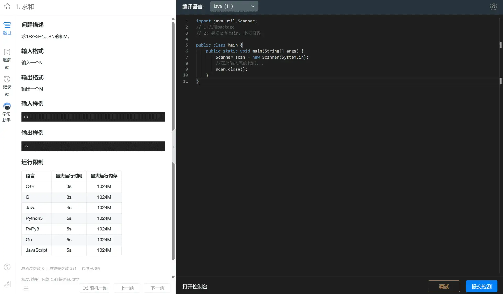
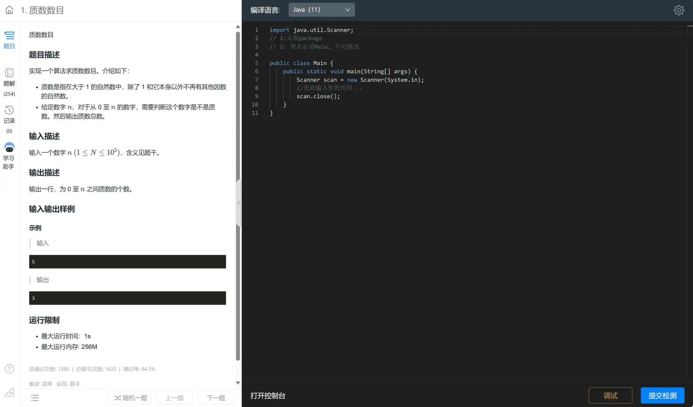
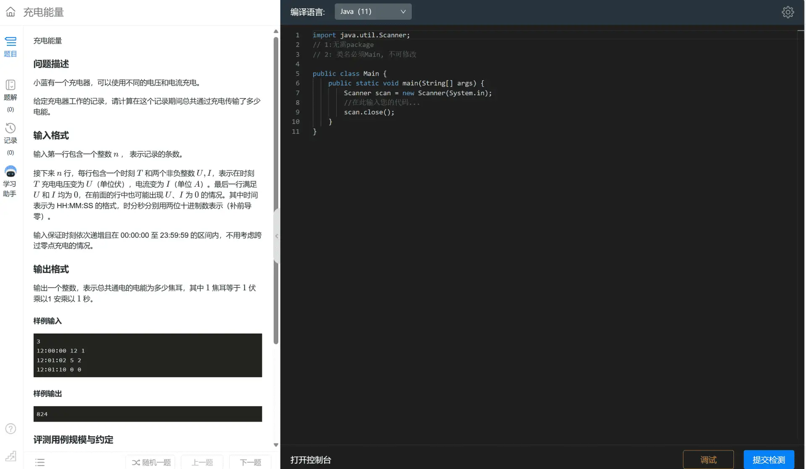
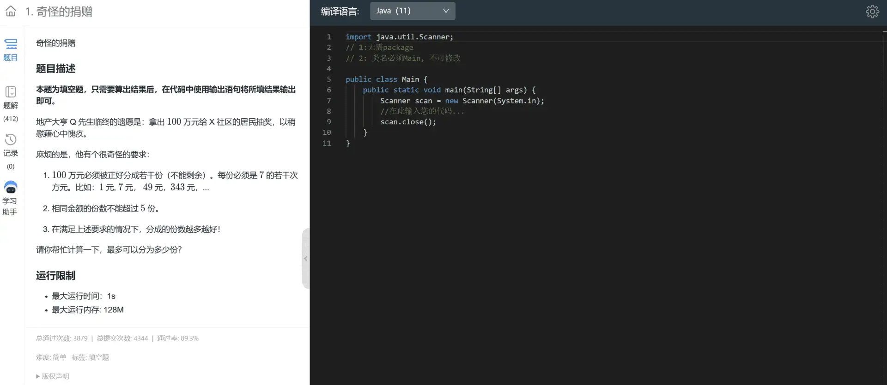
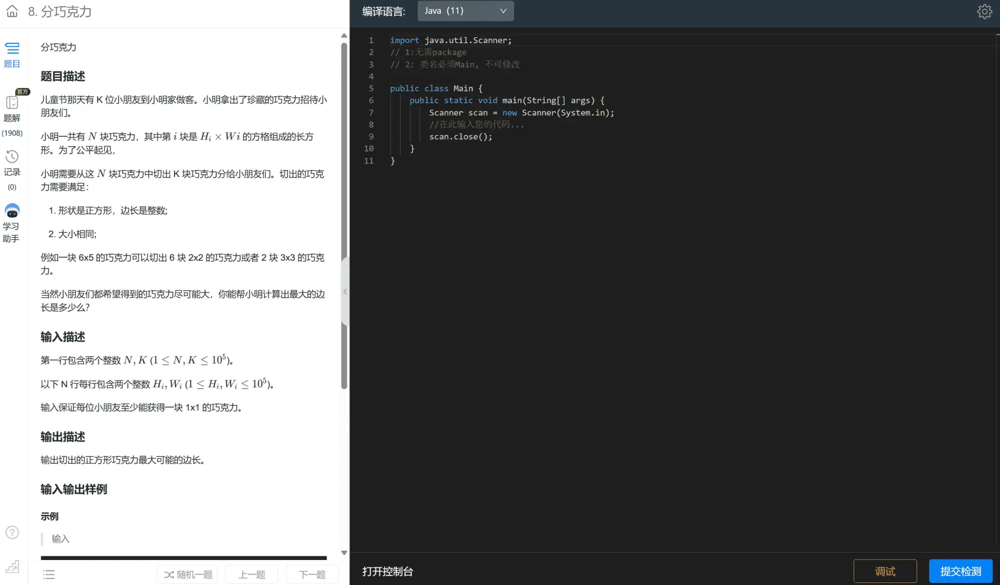
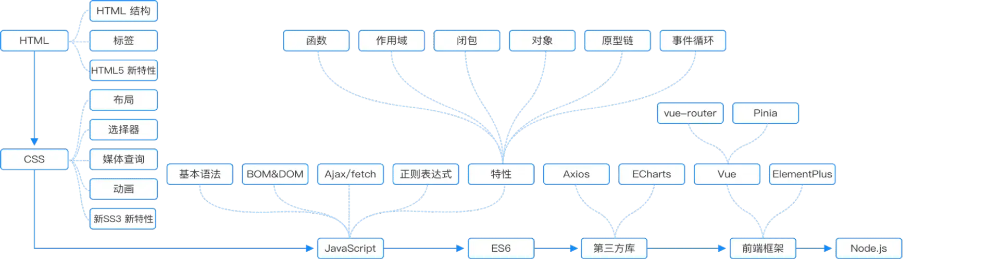

# 我的奇葩蓝桥杯经历

## 迷迷糊糊就入局了
大家知道我为什么要去参加蓝桥杯吗？大家可能以为我是想提升自己。 其实并不是这样，参加比赛是因为一个很离谱的原因，说出来你们可能不信。

之前我们不是在军训吗？军训又是一件非常累的事情，谁想参加呢？ 之后就听说有蓝桥杯这个活动，还听说参加蓝桥杯可以请假半天？ 听到这个消息谁不兴奋呢？管他啥活动，只要参加一个就能回寝室躺半天于是就直接参加了。

## 参加校赛
参加第一场比赛当天我就非常地高兴，因为去随便做做题就能逃一天的军训，简直不要太爽了。然后就美滋滋去比赛了，本来以为比赛的题目很难，随便做几题就可以去睡觉了。


### 开始做题
看到第一题我惊了，居然这么简单！
```
求1加到N的和
```


接着我就去做第二题，第二题也是很简单的题目，但是比第一题更难一点。
```
求0~N的质数的个数。
```


就这样一题一题的，每一题都比上一题难一点，记得当时做出来5题，很有成就感。这是我第一次做题做上瘾的。


### 校赛总结
整个校赛题目都是比较简单的题目，题目的难度是从低到高依次排列的，前面的题目简单，后面的题目越来越有挑战，就像闯关一样，很让人入迷。

最后结果也挺令人满意，成功入选晋级了省赛。


## 省赛备赛

### 研究校赛题
在考完校赛之后，我就对后面没做出来的题目很感兴趣，很想知道该怎么写，于是回去就在蓝桥杯官网上搜到了那些题目。开始研究起来。

比如这一题，当时就让我难受了一整天。



### 完全没怎么备赛
研究完感兴趣的题目之后，省赛的事情就被我忘了，天天都想着玩。

### 3天的刷题
直到省赛开始的前10天，我看到群通知才想起来。

第一天：省赛的难度是很高的，就直接开刷困难的题目，一打开傻眼了，根本看不懂...

第二天：那就从中等题目开始吧，随便打开一题，想了两天都没想出来，直接摆烂了..


### 最后两天

> 当时就想着报名费好像是300块钱吧！怎么也不能了浪费这300块钱，怎么也得拿个奖吧！啥奖都行，总之不能太舍人吧。

那就先刷简单题目吧。随便点开一题就会写，那种感觉就又回来了，当天我就刷了8题简单题目。第二天，感觉可以来一点普通题目挑战一下了，于是就随便打开了一题，居然写出来了。

最后两天的刷题又找到了当时校赛的感觉，那种做题的快乐。

## 参加省赛
省赛的难度，和校赛相比难许多，但是难度依旧是从低到高依次排列的，和校赛差不多但是这次我进步了做出来6题。

和第2题差不多


和第6题差不多


当时想着拿个三等奖就满意了，没想到结果拿了一等奖，很令人惊喜。


## 给学弟学妹们的建议
以我的真实经验来看:
- 蓝桥杯并不是一个很难的比赛，不要把他想得很难，觉得自己不配啥的，大胆报名去试试，反正也没什么损失是吧。
- 刷题不要着急去挑战高难度的，直接上那肯定是痛苦的，先从简单的开始刷，觉得差不多了再去挑战难一点的，一级一级去闯关。

## 参加蓝桥杯的学习路线

1. 学习一门编程语言 ( Java , C++ , Python )
2. 会一点点数学 ( 复习一下高中学的就差不多了，排列组合，几何等 )
3. 了解一下数据结构 ( 数组 , 栈 , 队列 , 链表 , 二叉树 )
4. 了解一下查找和排序算法 ( 二分法 , 冒泡排序 , 快速排序 )
5. 学会使用编程语言自带的常用工具库 ( 高精度数学计算 , 集合库 , 字符串库...)

- 如果还有时间可以再看一下`正则表达式`和对应语言的使用方法，我在省赛和国赛都用正则表达式秒杀过一题。


## web组经验分享

参加完java组比赛后，接着第二年又参加了web组比赛，web的备赛挺特别的，主要是考对web知识点的全面掌握不再是算法。



因为web考察的知识点非常多，短期内学完几乎是不可能的。学习的过程也是非常的痛苦。

我是因为在大一下学期的时候就对web很感兴趣，自学了vue3，并且考点上的知识基本都差不多会才报的web组，如果你讨厌内卷，不想搞算法，又对web很感兴那么报web组就是很好的选择。