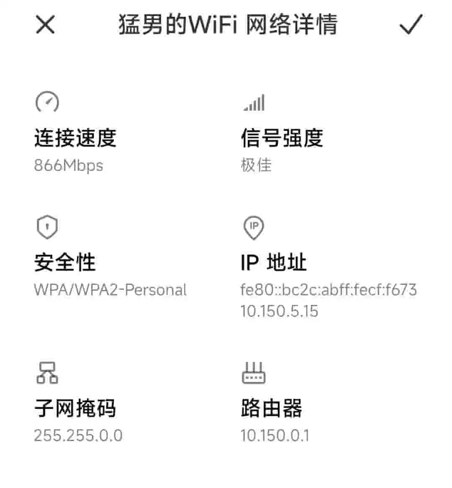
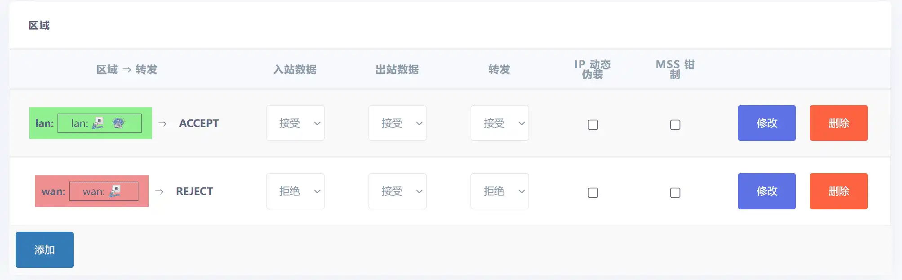
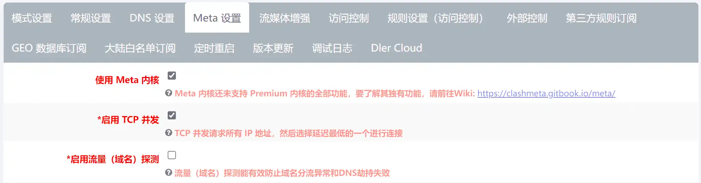

# 校园网多设备使用同一个账号防检测

## 前言
**我们的校园网巨贵，而且巨坑。**

**自己的路由器却是在为校园网服务**

绕过校园网检测首先需要有一个可以刷openwrt的路由器。

openwrt是一个开源的基于Linux的路由器系统，在他上面可以实现各种各样的功能，总之是非常的强大。

这次整活也就在这个系统上整。

## 收费巨贵还限制设备的校园网。
我们学校的校园网是每个寝室都有一条光纤，但是这个光纤和家用的有很大区别。

他们连接网络的方式是：我们花200租一个光猫，然后这个光猫只是接入一下他们的局域网。

之后还要自己购买一个路由器，而路由器的工作模式必须是桥接模式。手机和电脑接入连接自己路由器的wifi只是加入了他们的局域网。

并且手机连接自己的路由器是不能上网的，需要登录才能上网。

也就是手机电脑想使用WiFi就必须购买一个路由器然后把自己的路由器加入他们的网络作为AP节点，然后自己的电脑和手机登录他们的校园网账号。

那么我们自己也就不能创建属于自己的局域网。

不能创建自己的局域网意味着什么？windows文件共享不存在了。一些需要依靠局域网联机的游戏也不能联机了。等等。

**我觉得这样的网络非常不合理。**

如果你想直接用你自己的路由器DHCP上网，当你连接几台设备后你的账号就会被封禁10分钟。

这个方法我已经尝试过了，具体方法是：

将路由器设置成DHCP模式获取到一个他们的10开头的大内网，然后再用其他设置连接自己路由器获取到192开头的自己的内网ip。
之后因为连接会被路由器转发，所以可以用手机登录校园网。这个过程相当于手机帮路由器认证了。之后所有连接到路由器的设备都可以上网。
但是别高兴得太早，这样使用不到3分钟就无法上网了，当你再次登录的时候就会提示你的账号被封禁10分钟。

**所以我觉得这样的网络非常不合理。**

## 使用openwrt软路由绕过检测

### 关于校园网的检测多设备的方式
检测一个账号是否给多个设备使用的方法其实就几种。

**基于 HTTP 数据包请求头内的 User-Agent 字段的检测**

这种方法对于现在的网络状况其实已经有点无能为力了，因为现在几乎所有网站都使用https的协议。
因为https是加密的，所以也就无法检测了。

但是还是有少数应用和网站仍然使用http这一古老的协议，所以还是需要防范以下。并且经过测试，我们学校貌似也依然还在使用这种检测方式。

HTTP数据包请求头存在一个叫做 User-Agent 的字段，该字段通常能够标识出操作系统类型，例如：
~~~
Mozilla/5.0 (Windows NT 10.0; Win64; x64) AppleWebKit/537.36 (KHTML, like Gecko) Chrome/89.0.4389.72 Safari/537.36 Edg/89.0.774.45

Mozilla/5.0 (iPad; U; CPU OS 3_2_1 like Mac OS X; en-us) AppleWebKit/531.21.10 (KHTML, like Gecko) Mobile/7B405
~~~
若发现同时出现例如Windows NT 10.0 iPad 的字段，则判定存在多设备上网。

**基于 IPv4 数据包包头内的 TTL 字段的检测**

这种检测方式使用比较广泛，他的原理是检测数据包的TTL，数据包每经过一次转发TTL就会减1。
windows默认的TTL是128，手机一般是64。当电脑访问一个网站时，如果数据包没经过转发，在经过
校园网网关的时候TTL就是128，没有改变。如果连接了一个路由器，在经过校园网网关的时后TTL就会变成127
手机也是同样的道理，对于这种检测方式我们可以用修改TTL的方法绕过检测。

**基于 IPv4 数据包包头内的 Identification 字段的检测**

这种检测方式使用比较少，但是我们学校貌似使用了这个方式。总之都防范一下，稳妥。

IPID的检测方式可以参考这篇文章：http://www.techwander.cn/Wordpress/ipid%e9%9a%90%e8%97%8f%e7%bd%91%e7%bb%9c%e6%89%ab%e6%8f%8f/

我简单描述一下原理，就是检测IPID序号的增加和减少。

这里有一个项目可以绕过IPID的检测：https://github.com/CHN-beta/rkp-ipid

**基于网络协议栈时钟偏移的检测**

这种检测方式使用比较广泛，他的原理是不同主机物理时钟偏移不同，通过分析分析不同主机发送报文的频率来检测是否存在多态设备。

**DPI (Deep Packet Inspection) 深度包检测技术**

这个检测方案比较先进，检测系统会抓包分析应用层的流量，根据不同应用程序的数据包的特征值来判断出是否存在多设备上网。

此种方式已确认在锐捷相关设备上应用，当由于此项功能极耗费性能，因此有些学校可能不会开启此项功能。

对于这个技术基本上无解，唯一的办法就是使用代理上网加密数据包。

但是这种检测方案非常耗性能，所以一般学校不会开启此功能。

### 应对方法

**基于 HTTP 数据包请求头内的 User-Agent 字段的检测**
通过 Privoxy 修改 User-Agent

首先安装软件包

~~~
opkg update
opkg install privoxy luci-app-privoxy luci-i18n-privoxy-zh-cn
~~~

进入 Privoxy 管理页面设置，进入文件与目录，Action Files 中只保留 match-all.action，Filter Files 与 Trust Files 留空；进入访问控制，Listen Address 填写 0.0.0.0:8118，Permit Address 填写 192.168.0.0/16，勾选 Enable Action File Editor；进入杂项，勾选 Accept Intercepted Requests；进入日志，取消全部选项；点击保存并应用；进入 OpenWRT 防火墙设置，在自定义设置中填入以下内容：

~~~
# 将局域网内的 HTTP 请求转发到 Privoxy 代理服务器上
iptables -t nat -N http_ua_drop
iptables -t nat -I PREROUTING -p tcp --dport 80 -j http_ua_drop
iptables -t nat -I PREROUTING -p tcp --dport 8080 -j http_ua_drop
iptables -t nat -A http_ua_drop -m mark --mark 1/1 -j RETURN
iptables -t nat -A http_ua_drop -d 0.0.0.0/8 -j RETURN
iptables -t nat -A http_ua_drop -d 127.0.0.0/8 -j RETURN
iptables -t nat -A http_ua_drop -d 192.168.0.0/16 -j RETURN
iptables -t nat -A http_ua_drop -p tcp -j REDIRECT --to-port 8118
~~~

打开 http://config.privoxy.org/edit-actions-list?f=0；点击Edit，在 Action 那一列中，hide-user-agent 改选为 Enable - 在右侧 User Agent string to send 框中填写Mozilla/5.0 (Macintosh; Intel Mac OS X 10_14_4) AppleWebKit/537.36 (KHTML, like Gecko) Chrome/74.0.3729.108 Safari/537.36，其它全部选择为 No Change；点击 Submit。

**基于 IPv4 数据包包头内的 TTL 字段的检测**

修改所以经过路由器的数据包TTL值为固定值即可防止检测。

首先安装需要的软件包。
~~~
opkg update
opkg install iptables-mod-ipopt kmod-ipt-ipopt
~~~

配置防火墙，添加规则。即可将所有经过路由器的TTL值修改为64
进入 OpenWRT 防火墙设置，在 自定义设置 中填入以下内容：
~~~
iptables -t mangle -A POSTROUTING -j TTL --ttl-set 64
~~~

**基于 IPv4 数据包包头内的 Identification 字段的检测**

我们使用 rkp-ipid 这一内核模块进行修改。项目地址：https://github.com/CHN-beta/rkp-ipid

下载并安装rkp-ipid 
~~~
git clone https://github.com/CHN-beta/rkp-ipid.git package/rkp-ipid
make package/rkp-ipid/compile V=sc
~~~

设置所有发出的数据包的 IPID 为递增
进入 OpenWRT 防火墙设置，在 自定义设置 中填入以下内容：
注释的一行根据自己的校园网情况，因为我所在的是10开头的内网所以注释掉了10那个。
~~~
iptables -t mangle -N IPID_MOD
iptables -t mangle -A FORWARD -j IPID_MOD
iptables -t mangle -A OUTPUT -j IPID_MOD
iptables -t mangle -A IPID_MOD -d 0.0.0.0/8 -j RETURN
iptables -t mangle -A IPID_MOD -d 127.0.0.0/8 -j RETURN
# iptables -t mangle -A IPID_MOD -d 10.0.0.0/8 -j RETURN
iptables -t mangle -A IPID_MOD -d 172.16.0.0/12 -j RETURN
iptables -t mangle -A IPID_MOD -d 192.168.0.0/16 -j RETURN
iptables -t mangle -A IPID_MOD -d 255.0.0.0/8 -j RETURN
iptables -t mangle -A IPID_MOD -j MARK --set-xmark 0x10/0x10
~~~

**基于网络协议栈时钟偏移的检测**

在局域网中建立 NTP 服务器统一时间戳即可。

进入 OpenWRT 系统设置, 勾选 Enable NTP client（启用 NTP 客户端）和 Provide NTP server（作为 NTP 服务器提供服务）

NTP server candidates（候选 NTP 服务器）四个框框分别填写:
~~~
ntp1.aliyun.com
time1.cloud.tencent.com
stdtime.gov.hk
pool.ntp.org
~~~

进入 OpenWrt 防火墙设置，在 自定义设置 中填入以下内容:
最后的 192.168.1.1 需要修改为路由器网关地址
~~~
iptables -t nat -N ntp_force_local
iptables -t nat -I PREROUTING -p udp --dport 123 -j ntp_force_local
iptables -t nat -A ntp_force_local -d 0.0.0.0/8 -j RETURN
iptables -t nat -A ntp_force_local -d 127.0.0.0/8 -j RETURN
iptables -t nat -A ntp_force_local -d 192.168.0.0/16 -j RETURN
iptables -t nat -A ntp_force_local -s 192.168.0.0/16 -j DNAT --to-destination 192.168.1.1
~~~
这样 NTP 请求就会被劫持到路由器上了。

**基于 IPv4 数据包包头内的 Identification 字段的检测**
和
**基于 IPv4 数据包包头内的 TTL 字段的检测**
一起解决

直接不使用传统nat方式转发内网数据包，内网全部使用代理方式联网。

防火墙这样配置，内网不转发到外网。

这样配置完之后会发现是无法上网的。

之后我们打开openclash，在全局设置里这样配置。

核心推荐使用Meta核心，这个核心速度快且更强大。

添加一个没什么用的代理配置
~~~ yaml
mixed-port: 7890
allow-lan: true
bind-address: "*"
mode: Rule
log-level: silent
external-controller: 0.0.0.0:9090
redir-port: 7892
port: 7890
socks-port: 7891
secret: "123456"
external-ui: "/usr/share/openclash/dashboard"
dns:
  enable: true
  ipv6: false
  enhanced-mode: fake-ip
  fake-ip-range: 198.18.0.1/16
  listen: 0.0.0.0:7874
##Custom DNS##
  nameserver:
  - 112.124.47.27
#===================== OpenClash-General-Settings =====================#
Proxy:
  - {"type":"ss","name":"v2rayse_test_1","server":"198.57.27.218","port":5004,"cipher":"aes-256-gcm","password":"g5MeD6Ft3CWlJId"}
  - {"type":"vmess","name":"v2rayse_test_2","server":"154.23.190.162","port":443,"uuid":"b9984674-f771-4e67-a198-c7e60720ba2c","alterId":"0","cipher":"auto","network":"ws"}
  - {"type":"ssr","name":"v2rayse_test_3","server":"20.239.49.44","port":59814,"protocol":"origin","cipher":"dummy","obfs":"plain","password":"3df57276-03ef-45cf-bdd4-4edb6dfaa0ef"}
  - {"type":"trojan","name":"v2rayse_test_4","server":"ca-trojan.bonds.id","port":443,"password":"bc7593fe-0604-4fbe-a70bYWVzLTI1Ni1nY206Q1VuZFNabllzUEtjdTaclWNFc1RmRBNk5NQU5KSnga3fa58ac5a3ef0-b4ab-11eb-b65e-1239d0255272","udp":true,"skip-cert-verify":true}
Proxy Group:
  - name: 自定义分组
    type: select
    proxies:
      - v2rayse_test_1
      - v2rayse_test_2
      - v2rayse_test_3
      - v2rayse_test_4
Rule:
- MATCH,DIRECT

~~~

最后启动openclash，这样局域网中的所有连接就都被路由器代理了。

## 第一套方案实践

### 1.购买软路由
我选择的是FriendlyElec NanoPi-R1S-H5开发板。

在小黄鱼上150多一个

### 2.刷固件
openrt固件是2020-03-20-NanoPi R1s H5_full_v2.1 里面貌似自带了 rkp-ipid 
可以在这里下载到：https://www.ethanshooter.com/blog/57.html

这个开发板刷固件比较简单，只需要把镜像写入SD卡插入即可。系统直接在SD卡上运行。

### 3.设置openwrt
刷完固件之后，插上电，等一会就会出现一个WIFI “FrendlyWrt-XXXXXX” 初始密码是passdo20。

连接WIFI之后进入管理页面。初始账号是root，密码是password

按照上述应对方案配置openwrt。

### 使用体验

使用openclash的方法是最稳定的，并且还可以科学上网。

强制把80和8080端口转发到Privoxy后会出现一些问题，有些服务器的80和8080不是http协议就会导致无法连接。

