# 用旧电脑开一个我的世界服务器
jja:首先你需要有一天旧电脑，要能开机。

w:这不是废话吗？

jja:需要安装windows系统。

w：谁家不是啊。

jja：需要联网。

w：这不是废话吗？

## 好的，下面就把我开服务器的检验都传授给大家吧！
一定要看完哦！

开服之前我们需要一个服务端核心，只需要启动服务端核心就成功的运行了mc服务器了。

那么去什么地方下载呢？

可以在这里下载官方的服务端。

https://www.minecraft.net/zh-hans/download/server
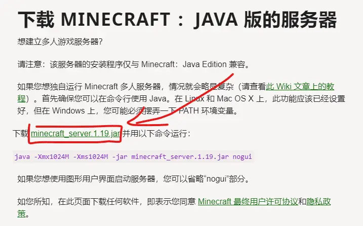

之后我们就会得到服务端核心。

有了这个核心我们就可以那他开服务器了。

怎么运行这个核心呢？

我们在核心所在的文件夹地址栏输入cmd，按下回车键。

输入java -jar 你的核心名字.jar
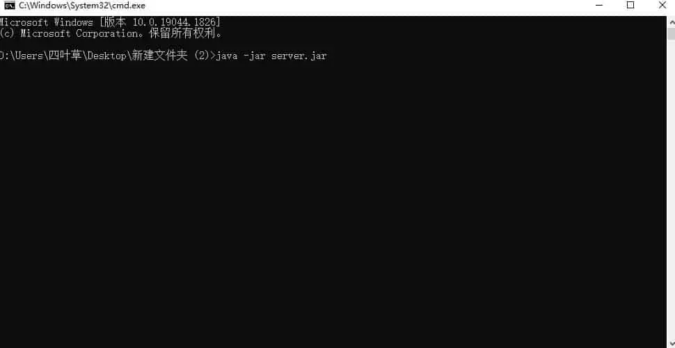

如果出现这个错误说明你的java版本太低，需要安装最新的java。
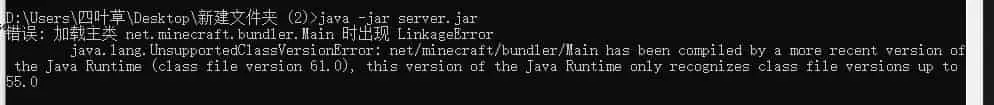

如果出现这个错误说明你电脑上没有java，需要安装java。

最新的java下载地址
https://www.oracle.com/java/technologies/downloads/#jdk18-windows
选择windows。
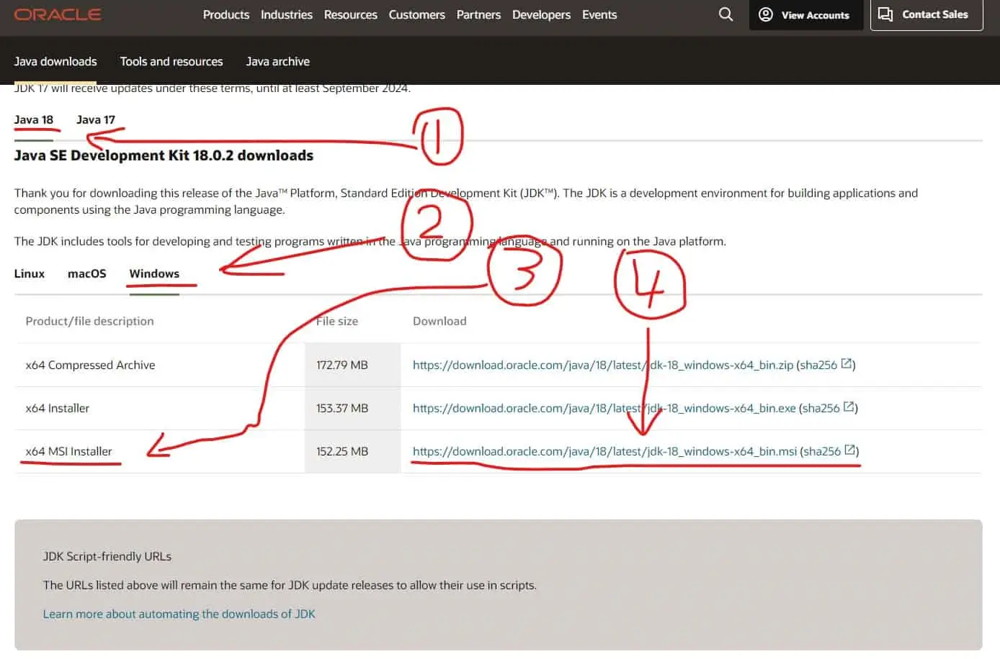

下载之后开始安装。
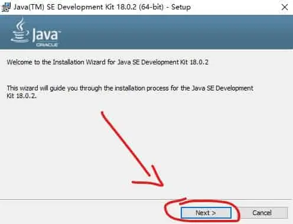
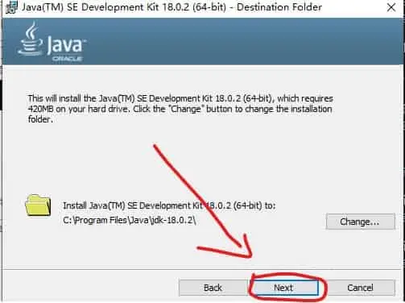
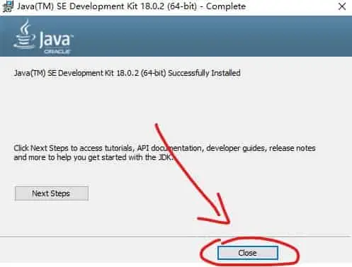

安装好之后使用上面的方法从新打开cmd，输入命令启动服务器。
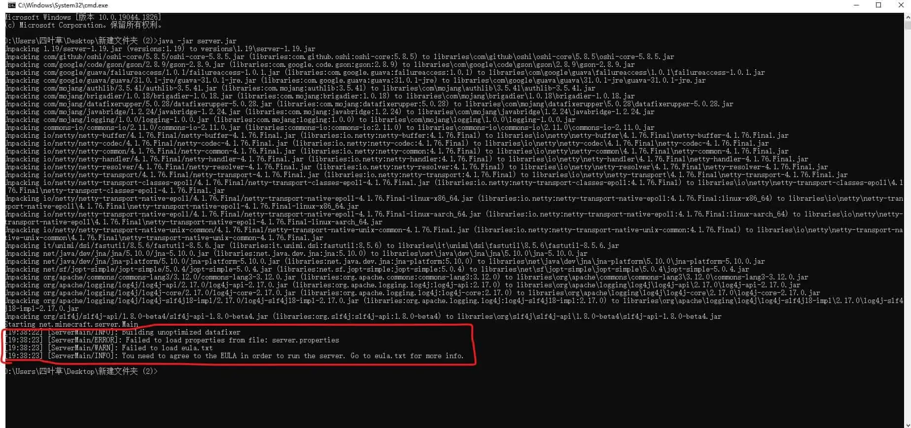
看见这几句话说明java已经安装好了。

之后打开eula.txt文件，同意一下MinecraftEULA
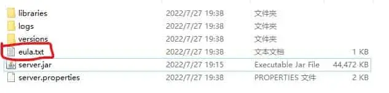

将false改成true，保存一下。
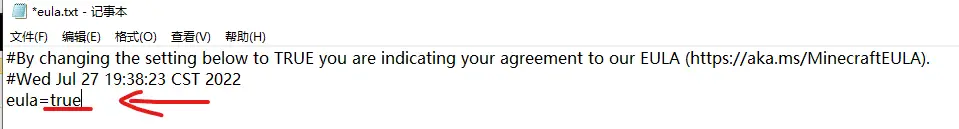

之后再次启动服务器，看见开始加载了就说明启动成功了。25565是mc服务器的默认端口号。
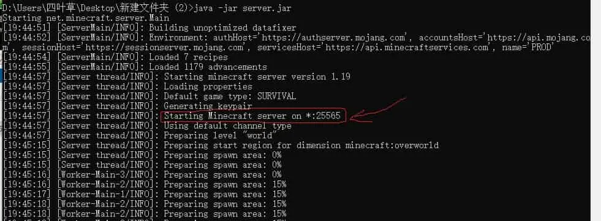

现在我们怎么连接他呢？
如果你在同一台电脑上打开我的世界，那么你可以使用 127.0.0.1 来连接。如果端口号不是25565，那么可以使用“127.0.0.1:端口号”来连接。

如果你没有mc正版账号，会显示无效会话
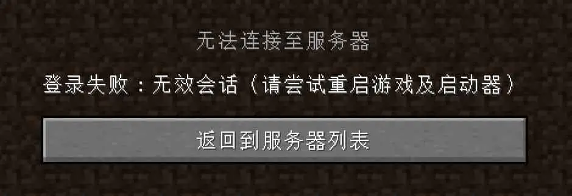

可以打开server.properties配置文件。找到下方截图划线的选项，将true改成false，之后重启服务器即可。
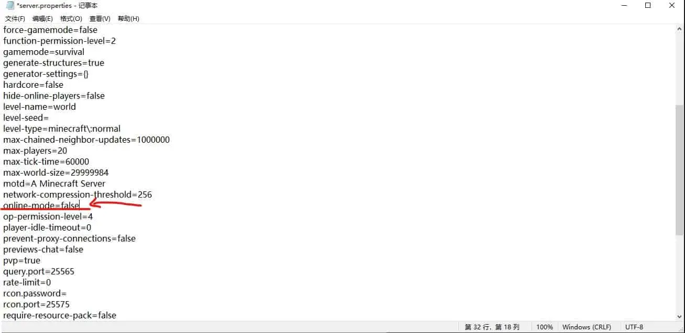

在cmd中输入stop可关闭服务器，等待服务器关闭之后。输入之前的开服命令即可启动服务器。
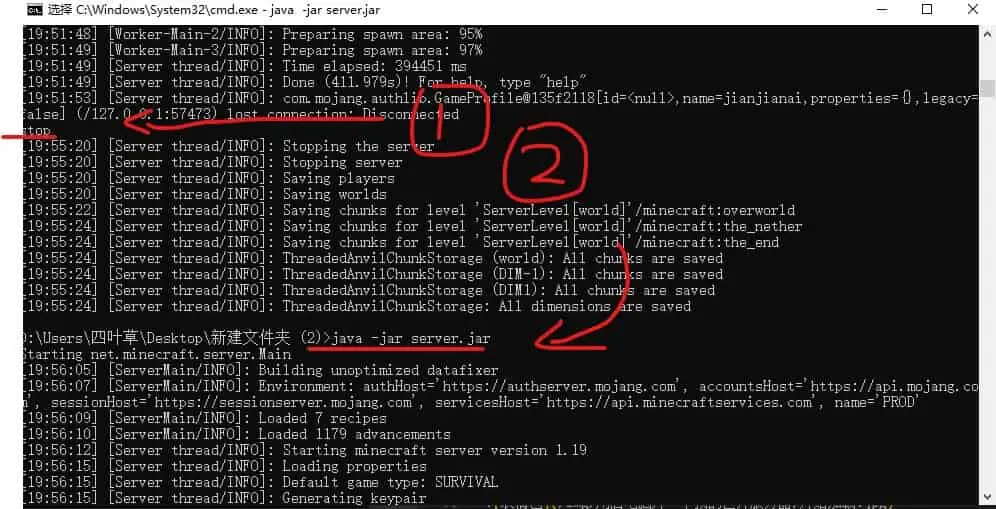

等待服务器启动之后就可以进入服务器了。

## 好的，那么开服教程就到此结束了

w:我tm一个人玩还开什么服务器啊！

w:看了半天，不能联机有什么用？

jja:对哦，差点忘了教你们联机了。

## 下面是联机教程

首先需要下载一个启动器

下载地址https://www.mcbbs.net/thread-719579-1-1.html

怎么下载就不教了，会玩mc的应该都见过。

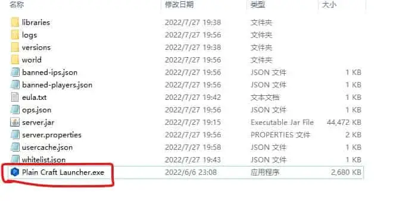

之后我们启动他
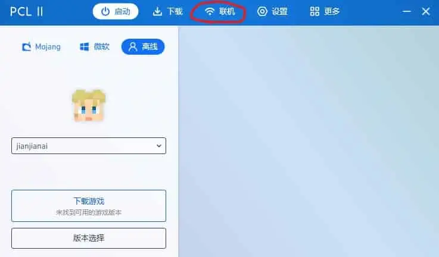
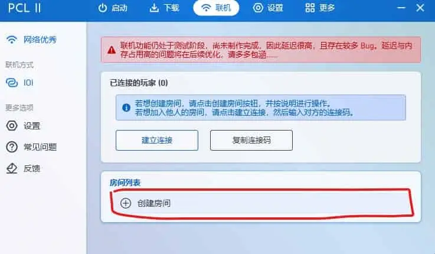
输入之前服务器上显示的端口号
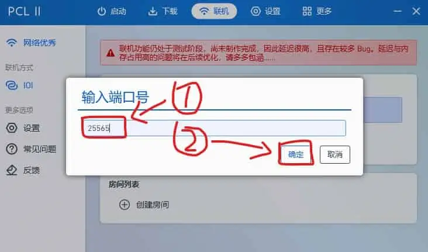
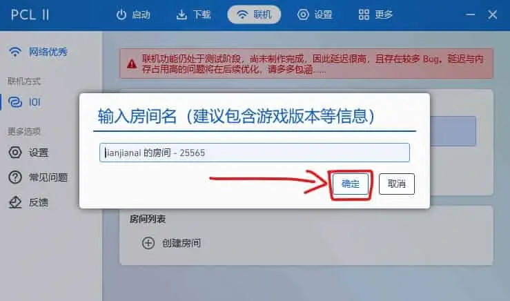
复制连接码，分享给小伙伴，
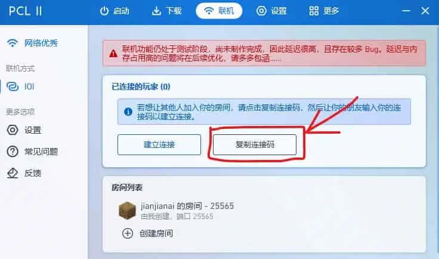

之后小伙伴点击建立连接
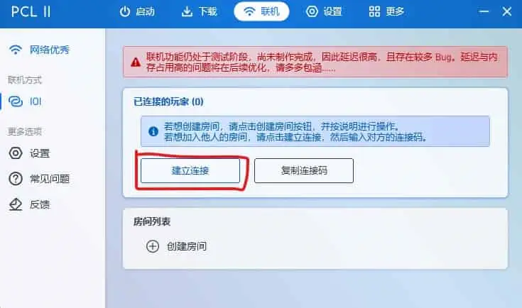
输入连接码
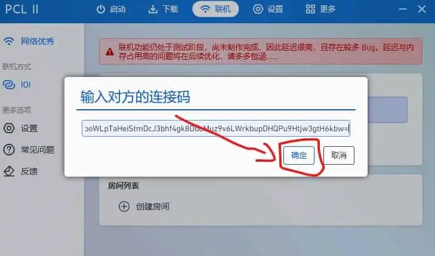
点击对方的房间
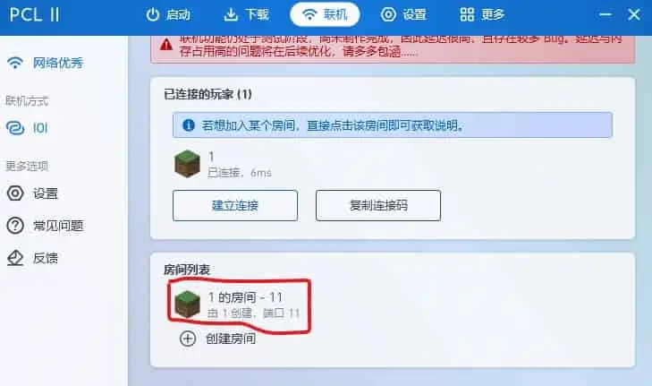
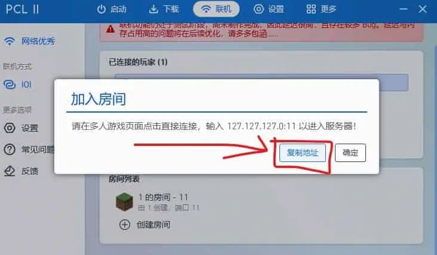
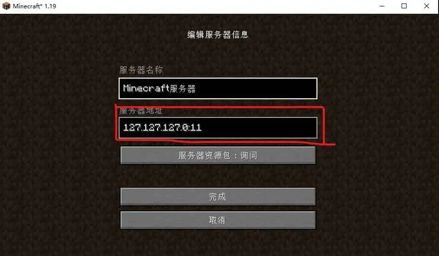
之后就可以愉快的联机了