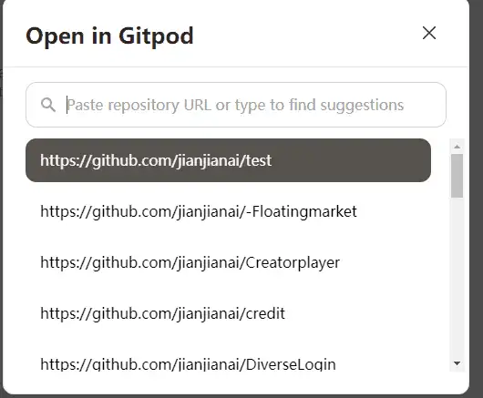
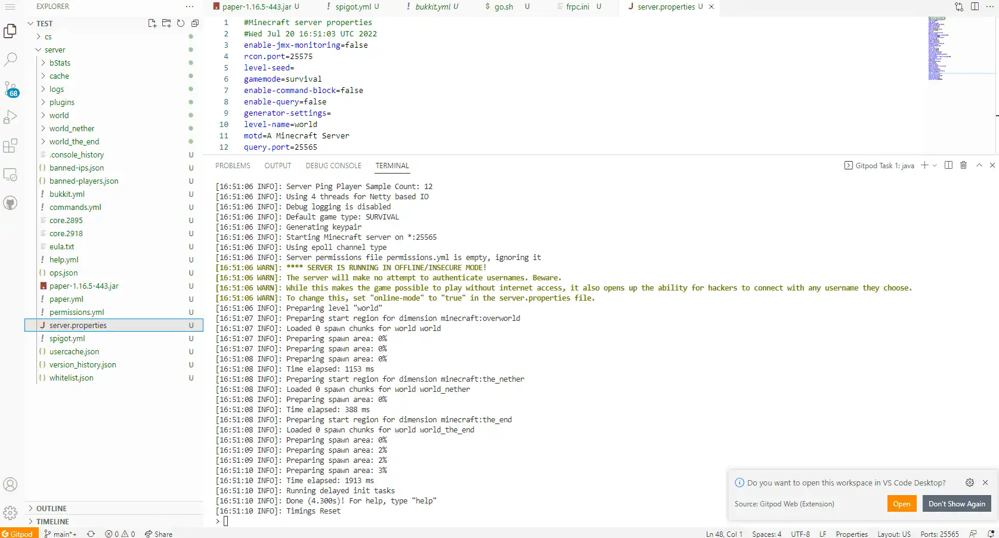

# 在gitpod上开mc服务器

<iframe style="width: 100%;aspect-ratio: 16/9;" src="//player.bilibili.com/player.html?aid=941135262&bvid=BV1UW4y117P7&cid=780187355&page=1" scrolling="no" border="0" frameborder="no" framespacing="0" allowfullscreen="true"> </iframe>

gitpod是一个网页在线IDE，是用来在线开发的。里面是有java环境的。有java的地方就能跑mc服务器，于是我决定尝试一下。
首先在github上创建了一个test仓库。然后用gitpod打开这个仓库。

之后把mc服务器上传。

然后就是传统艺能，在终端里敲 java -jar paper-1.16.5-443.jar

之后服务器真的跑起来了。

虽然服务器是跑起来了，但是没有公网的端口是无法连接的。于是我就找了一个内网穿透，也在上面跑起来了。
之后就可以连接了。虽然延迟有点高。

进去敲了看了下tps，还挺高的。

__然后就是传统的TNT炸服测试！！__

gitpod的服务器真不错，这么多TNT都不卡的。

之后是传统艺能，实体卡服测试。我的mc已经卡得不行了，gitpod的服务器都不卡的，真的6。

又玩了很久，服务器依然稳定运行。

之后我把网页关掉了，看他还能运行多久。
大概20分钟之后，mc连接丢失。再登上去看服务器已经停止了。再次启动服务器地图和背包都还在，存在gitpod服务器上呢。

所以说，只要一台垃圾电脑挂网页。就可以永久无限用awa。