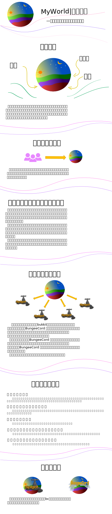

# 介绍
一款基于Paper开发的小队世界插件。可以在多个服务器之间同步世界，轻松多个服务器负载均衡。适合大型服务器。

## 建议
建议在Paper上使用本插件，Paper对加载世界的速度有优化。
Spigot加载世界耗时是Paper的15倍左右。

## 下载
发行版下载：[MyWorld 发行版 - Gitee.com](https://gitee.com/jja8/MyWorld/releases) （作者很懒，所以版本可能很旧）

## 使用方法和常见问题
插件命令列表：[命令.md · 简简爱/MyWorld](https://gitee.com/jja8/MyWorld/blob/jianjianai/命令.md)

插件使用方法：[插件使用方法.md · 简简爱/MyWorld](https://gitee.com/jja8/MyWorld/blob/jianjianai/插件使用方法.md)

常见问题解答：[常见问题解答.md · 简简爱/MyWorld](https://gitee.com/jja8/MyWorld/blob/jianjianai/常见问题解答.md)

建议与反馈-Issues：[Issues · 简简爱/MyWorld](https://gitee.com/jja8/MyWorld/issues)  (推荐)

建议与反馈-插件实验室：[PlugClub / 插件实验室](https://jq.qq.com/?_wv=1027&k=LyeQlfSK) （群号:820131534）

计划和日志：[日志和安排.md· 简简爱/MyWorld](https://gitee.com/jja8/MyWorld/blob/jianjianai/日志和安排.md)

## 统计

## 简介
### 玩法
玩家可以自行组建团队，每个团队可以拥有一组世界(主世界，地狱，末地，或通过扩展添加其他世界。)

团队中的玩家必须都很信任。所以设计了这样的机制：一旦加入团队，团长和管理员没有任何方法踢出团队成员，只能成员自己退出。

在线的不同团队是可以互相串门的，但是在没有信任的情况下是只能参观。

### 负载均衡
世界可以在多个服务器之间同步，但是不能在多个服务器中同时加载同一个世界，把世界分散到多个服务器中加载可以完美的负载均衡。

推荐硬盘小的腐竹使用空岛玩法，因为比较节约硬盘空间。如果你对默认的虚空生成器不满意，也可以去下载其他的虚空生成器，例如VoidGen。

如果你有很大的硬盘空间那么我很推荐你用完整世界的玩法。

### 注意事项
支持地形插件。但有可能和一些多世界的插件冲突，例如Multiverse-Core。

可能造成一些保存坐标的传送插件产生错误，例如传送点，传送书等插件。

可能出现 地图(地图这个物品) 在多个服务器之间同步后无法显示。

可能在升级服务端版本后地图数据和玩家背包数据出错，升级前一定要备份。

因为Bukkit和Pape的API无法实现部分功能，所以插件并不是完全基于Bukkit和Pape的API开发，使用了部分com.mojang，net.minecraft.server，org.bukkit.craftbukkit包下的非API类。所以插件只支持作者主动兼容的服务端版本。对于这种情况请希望你可以理解。

## 机制
玩家可以创建或加入团队，每个团队都可以创建一个世界。每个玩家只能加入一个团队。

只有团队中的玩家可以通过命令去团队的世界。

如果想去其他团队的世界可以用tpa等方法过去，如果其他团队没有成员在线是不能过去的。

团长和管理可以授予其他玩家信任，但是拥有信任的玩家如果团队没有成员在线也是不能进入世界的。

# 将来会实现的功能
- 玩家自主生物群系设置 （在做了，在做了）
- 世界蓝图 （这个也太难了，咕咕咕）
- 玩家在自己的世界重生 （慢慢来，咕咕咕）

