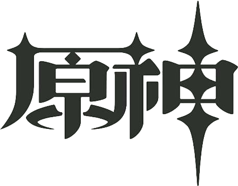

---
# 页面路径
permalinkPattern: 2023/11/28/ysstart/

title: 原神启动!!! css动画详解。
description: 纯css动画实现原神启动，简单秒懂，零基础。互动教程理解更透彻。
tag: ["前端","css"]
star: true
head:
- [meta, { name: keywords , content: css动画 fixed }]

# sitemap 如果为 false 则不写入
# 更新频率 changefreq -> "always" | "hourly" | "daily" | "weekly" | "monthly" | "yearly" | "never"
# 优先级 priority -> 范围 0 至 1。

sitemap:
changefreq: never
priority: 0.5

# 启用评论评论
comment: true
---

<script setup>
    import { ref, computed } from "vue"
    // 试一试1
    const test1p = ref("absolute");
    const test1x = ref("left");
    const test1xin = ref("1px");
    const test1y = ref("top")
    const test1yin = ref("1px");
    const test1style = computed(() => {
        return `position: ${test1p.value};
    ${test1x.value}:${test1xin.value};
    ${test1y.value}:${test1yin.value};`
    });
    const test1code = computed(() => {
        return `img.ys{
    ${test1style.value}
}`
    });

    // 试一试2
    const test2p = ref("relative");
    const test2y = ref("12px");
    const test2style = computed(()=>{
        return `position:${test2p.value};
    top:${test2y.value};`
    });
    const test2code = computed(() => {
        return `img.ys{
    ${test2style.value}
}`
    });

    //试一试2
    const test3ap = ref(true);
    const test3bp = ref(true);

    //试一试3
    const test4x = ref("1px");
    const test4y = ref("1px");
</script>

# 前情
最近原神启动非常火，突然有一天我想随时随地原神启动。就想能不能用网页做一个原神启动呢？
有想法就要立即去做，于是很轻松这个效果就做好了。但是原神启动之后应该跳转到哪呢？
思考了很久，觉得那就跳转到一个教程页面吧，让大家都可以自己动手原神启动一下岂不是很完美？

# 条件
这个教程非常基础，很适合初学者，但是还是需要一些基础知识。
- html class(类) 的用法。
- css 选择器 的用法和一些简单的属性。

# 基础知识


## 了解```position```的三个属性和常见的搭配

```position``` 通常需要和 ```top```,```bottom``` ,```left```,```right``` 这四个属性配合起来一起使用。

- ```top``` 代表当前元素上方的距离。
- ```bottom``` 代表当前元素下方的距离。
- ```left```,```right``` 以此类推，分别代表左边和右边。


<Tips title="小知识">

通常，在使用```top```时不使用```bottom```,在使用```left```时不使用```right```。

</Tips>


<style scoped>
    .dorkd-title{
        display: none;
    }
    .try1div {
        display: flex;
        flex-direction: row;
        align-items: stretch;
    }

    @media (max-width:550px) {
        .try1div {
            flex-direction: column;
        }
    }
    @media (prefers-color-scheme: dark) {
        img.ys{
            filter: invert(1);
            background-color: #ffffff00;
        }
        .dorkd-title{
            display: block;
        }
    }
</style>

### fixed
将 ```position``` 设为 ```fixed``` 则会相对于当前网页的窗口进行定位。```top```则表示从网页窗口的最上面到当前元素的距离。
```left```则代表从网页窗口的最左边到当前元素的距离。```bottom```,```right``` 以此类推，分别代表最下方和最右方。

<Demo title="试一试">
    <div class="try1div">
        <div style="position: relative;flex: 1;border: 0.1rem solid var(--color);min-height: 5rem;">
            
        </div>
        <pre style="flex: 1;margin: 0;">{{test1code}}</pre>
        <div style="flex: 1">
            左右 <button @click="test1x='left'">left</button> <button @click="test1x='right'">right</button>
            <input type="text" v-model="test1xin">
            <br />
            上下 <button @click="test1y='top'">top</button> <button @click="test1y='bottom'">bottom</button>
            <input type="text" v-model="test1yin">
            <br />
            定位 <button @click="test1p='fixed'">fixed</button> <button @click="test1p='relative'">relative</button>
            <button @click="test1p='absolute'">absolute</button>
        </div>
    </div>
</Demo>

### relative
将 ```position``` 设为 ```relative``` 则会相对于当前位置进行定位。```top```则表示向下便宜的距离。
```left```则代表向右便宜的距离。```bottom```,```right``` 以此类推，分别代表向上偏移和向左偏移。

<Tips title="小知识">

将 ```position``` 设为 ```relative``` 后，元素位置偏移后，依然会占有原来的位置。
    
</Tips>

<Demo title="试一试">
    <div class="try1div">
        <div style="border: 0.1rem solid var(--color);flex: 1;min-height: 5rem; position: relative;">
            <p>yyds!</p>
            <p>绝了！启动！</p>
            <p>yyds!</p>
        </div>
        <pre style="flex: 1;margin: 0;">{{test2code}}</pre>
        <div style="flex: 1;">
            偏移 <button @click="test2y='0px'">0px</button> <button @click="test2y='12px'">12px</button> <button @click="test2y='30px'">30px</button> <button @click="test2y='60px'">60px</button><br/>
            定位 <button @click="test2p='fixed'">fixed</button> <button @click="test2p='relative'">relative</button> <button @click="test2p='absolute'">absolute</button>
        </div>
    </div>
</Demo>

### absolute

将 ```position``` 设为 ```absolute``` 则会相对于祖宗设置为 ```relative``` 的元素进行定位,如果没有符合条件的祖宗元素则会相对于整个网页进行定位。```top```则表示从这个元素的最上面到当前元素的距离。
```left```则代表从这个的最左边到当前元素的距离。```bottom```,```right``` 以此类推，分别代表最下方和最右方。

<Demo title="试一试">
    <div class="try1div">
        <div style="border: 0.1rem solid var(--color);flex: 2;min-height: 8rem;" :style="test3ap?'position: relative;':''">a
            <div style="border: 0.1rem solid var(--color);min-height: 4rem; width: 70%;" :style="test3bp?'position: relative;':''">b
                
            </div>
        </div>
        <pre style="flex: 1;margin: 0;">div.a{{test3ap?"{\n    position: relative;\n}":"{\n\n}"}}
div.b{{test3bp?"{\n    position: relative;\n}":"{\n\n}"}}
img.ys:{
    position:absolute;
    top:10px;
    left:10px;
}</pre>
    </div>
    <div>
        <button @click="test3ap=!test3ap">添加删除a absolute</button>
        <button @click="test3bp=!test3bp">添加删除b absolute</button>
        <span v-if="!test3ap && !test3bp">将网页滑到最上面，看左上角，可以找到图片哦！</span>
    </div>
</Demo>


## 了解```transform```中的```translate(x,y)```
```transform```中的```translate(x,y)```和```position```使用```relative```时很相似，都是相对于自己当前位置进行偏移,```x```和```left```的用法很相似,```y```和```top```的用法很相似。

<Demo title="试一试">
    <div class="try1div">
        <div style="border: 0.1rem solid var(--color);flex: 1;min-height: 5rem;">
            
        </div>
        <pre style="flex: 1;margin: 0;">img.ys:{
    transform:translate({{test4x}},{{test4y}});
}</pre>
        <div style="flex: 1;">
            x<input type="text" v-model="test4x"><br/>
            y<input type="text" v-model="test4y">
        </div>
    </div>
</Demo>


# 完美的的居中

要实现元素启动动画,首先要了解如何使用css将图片居中显示。
下面将介绍几种将图片完美居中的几种方式。

## 左右居中

### 方式一，使用```margin: auto;```

给元素设置 ```margin: auto;``` 即可相对父元素左右居中。

<Tips title="注意" color="orange">

元素仅在 ```display: block;``` 时 ```margin: auto;``` 才会将元素相对于父元素左右居中。
`````` 标签默认值为```display: inline-block;
```所以不会生效，需要指定```display: block;```才能居中。

</Tips>

<Demo title="效果演示">
    <div class="try1div">
        <div style="border: 0.1rem solid var(--color);flex: 2;min-height: 5rem;">
            
        </div>
        <pre style="flex: 1;margin: 0;">img.ys{
    display: block;
    margin: auto;
}</pre>
    </div>
</Demo>

### 方式二，```position:absolute;``` + ```left:50%;```+ ```transform:translate(-50%,0);```

1. 给需要相对于居中的祖宗元素设置```position: relative;```
2. 使用```position:absolute;```相较于父元素进行定位。
3. 使用```left:50%```向右平移相对于定位元素宽的50%

<Demo title="效果演示">
    <div class="try1div">
        <div style="border: 0.1rem solid var(--color);flex: 2;min-height: 5rem;position: relative;">
            
        </div>
        <pre style="flex: 1;margin: 0;">img.ys{
    position: absolute;
    left: 50%;
}</pre>
    </div>
</Demo>
<Tips title="问题" color="orange">

这时候你会发现,向右移多了自己的50%宽度。并没有完美得居中。所以还需要第4步骤,将多移的50%移回来。
这时候之前讲到的```transform:translate(x,y);```就要发挥用途了。

</Tips>

4. 使用```transform:translate(-50%,0);```向左平移自己的50%。

<Demo title="效果演示">
    <div class="try1div">
        <div style="border: 0.1rem solid var(--color);flex: 2;min-height: 5rem;position: relative;">
            
        </div>
        <pre style="flex: 1;margin: 0;">img.ys{
    position: absolute;
    left: 50%;
    transform:translate(-50%,0);
}</pre>
    </div>
</Demo>

<Tips title="小知识">

- ```left:50%;``` 是相较于定位的元素的宽度的50%。
- ```transform:translate(50%,0);``` 是自身宽度的50%。

两者的百分比参考对象是不同的。利用这些特性也可以完美居中。

</Tips>

## 上下居中

### 方式 ```position:absolute;``` + ```top:50%;```+ ```transform:translate(0,-50%);```

和[左右居中的方式二](#方式二-position-absolute-left-50-transform-translate-50-0)同理，
所以不用多解释了吧，直接上代码！

<Demo title="效果演示">
<div style="border: 0.1rem solid var(--color);flex: 2;min-height: 8rem;position: relative;">
    
</div>

``` css
img.ys{
    position: absolute;
    top: 50%;
    transform:translate(0,-50%);
}
```

</Demo>


## 结合起来上下左右居中

<Demo title="效果演示">
<div style="border: 0.1rem solid var(--color);flex: 2;min-height: 8rem;position: relative;">
    
</div>
    
``` css
img.ys{
    position: absolute;
    left: 50%;
    top: 50%;
    transform:translate(-50%,-50%);
}
```
    
</Demo>

# 原神启动还缺少点灵魂 “动画”

<Tips title="提示！" color="yellow" class="dorkd-title" >

接下来建议关闭深色模式浏览，虽然此页面已经对深色模式进行了适配，但是使用深色模式原神启动总感觉缺少点味道，不够还原。
为了最好的观看体验，建议关闭深色模式观看。
        
</Tips>

已经利用之前的知识将 “原神” 居中了。看起来已经有点那个味道了。接下来将添加动画，为它注入灵魂。
使用 ```animation``` 属性来为图片设置动画。使用 ```@keyframes``` 来定义动画。

<Demo title="效果演示">
    <div style="border: 0.1rem solid var(--color);min-height: 24rem;position: relative;">
        
    </div>
</Demo>

## 了解```@keyframes```

```@keyframes``` 用于定义动画的关键帧,关键帧可以在不同的css属性之间过渡。

最简单的用法,定义一个```ysstart```动画,使不透明的从100%降到0%

``` css
@keyframes ysstart{
    from{
        opacity:100%
    }
    to{
        opacity:0%
    }
}
```
或者可以这样写。
``` css
@keyframes ysstart{
    0%{
        opacity:100%
    }
    100%{
        opacity:0%
    }
}
```
<Tips title="推荐">

我更推荐使用百分比写法,这种写法更加自由。

</Tips>


## 了解 ```animation```

```animation```有许多属性，这里只介绍我们用到的。

- ```animation-name``` 指定由@keyframes描述的关键帧名称。
- ```animation-duration``` 设置动画一个周期的时长。
- ```animation-iteration-count``` 设置动画重复次数，可以指定 infinite 无限次重复动画
- ```animation-timing-function``` 设置动画速度，即通过建立加速度曲线，设置动画在关键帧之间是如何变化。

例如
``` css
img.ys{
    animation-name:ysstart; /* ysstart 是动画的名称 */
    animation-duration: 3s; /* 动画共持续3秒 */
    animation-iteration-count: 1; /* 动画只播放1次 */
    animation-timing-function: linear; /* 匀速播放 */
}
```

或者可以缩写
``` css
img.ys{
    animation:ysstart 3s 1 linear; 
}
```

<Tips title="小知识">

缩写可以不按照顺序书写,例如这样也是对的。

``` css
img.ys{
    animation:linear 1 ysstart 3s; 
}
```
    
</Tips>

## 将两者集合,开始注入灵魂

将之前用```@keyframes```定义的关键帧和```animation```集合。这样就实现了不透明度从100%到0%的渐变效果。


<Demo title="效果演示">
    <div style="border: 0.1rem solid var(--color);min-height: 24rem;position: relative;">
        
    </div>
</Demo>

<style scoped>
@keyframes ysstart-d1{ /* 定义 ysstart 动画关键帧 */
    0%{
        opacity:100%;
    }
    100%{
        opacity:0%;
    }
}
img.ys-d1{
    animation-name:ysstart-d1; /* ysstart 是动画的名称 */
    animation-duration: 3s; /* 动画共持续3秒 */
    animation-iteration-count: infinite; /* 动画只播放1次 */
    animation-timing-function: linear; /* 匀速播放 */
}
</style>

``` css
@keyframes ysstart{ /* 定义 ysstart 动画关键帧 */
    0%{
        opacity:100%; /* 不透明度100% */
    }
    100%{
        opacity:0%;
    }
}
img.ys{
    animation-name:ysstart; /* ysstart 是动画的名称 */
    animation-duration: 3s; /* 动画共持续3秒 */
    animation-iteration-count: 1; /* 动画一直重复播放 */
    animation-timing-function: linear; /* 匀速播放 */
}
```


接下来,简单修改一下,将持续时间增加到6秒,再添加一个淡出的过程。是不是就很有感觉了？


<Demo title="效果演示">
    <div style="border: 0.1rem solid var(--color);min-height: 24rem;position: relative;">
        
    </div>
</Demo>

<style scoped>
@keyframes ysstart-d2{ /* 定义 ysstart 动画关键帧 */
    0%{
        opacity:0%;
    }
    50%{
        opacity:100%;
    }
    100%{
        opacity:0%;
    }
}
img.ys-d2{
    animation-name:ysstart-d2; /* ysstart 是动画的名称 */
    animation-duration: 6s; /* 动画共持续3秒 */
    animation-iteration-count: infinite; /* 动画只播放1次 */
    animation-timing-function: linear; /* 匀速播放 */
}
</style>

``` css
@keyframes ysstart{ 
    0%{
        opacity:0%;
    }
    50%{
        opacity:100%;
    }
    100%{
        opacity:0%;
    }
}
img.ys-d2{
    animation-name:ysstart; 
    animation-duration: 6s; 
    animation-iteration-count: infinite; 
    animation-timing-function: linear; 
}
```


<!-- ``` -->

<div class="start-main">
    
    <div class="yuantext">
        <p>抵制不良游戏，拒绝盗版游戏。注意自我保护，谨防受骗上当。适度游戏益脑，沉迷游戏伤身。合理安排时间，享受健康生活。</p>
        <p>此界面仅用于学习和交流</p>
    </div>
</div>

<style scoped>
    .yuantext p {
        margin: 0;
        font-weight: bolder;
        font-size: 1rem
    }

    .yuantext {
        width: 100%;
        position: absolute;
        bottom: 0;
        margin-bottom: 1rem;
        text-align: center;
        animation: yuantext-animation 7s linear 0s 1;
    }

    .yuanimg {
        background-color: #ffffff00;
        position: absolute;
        left: 50%;
        top: 50%;
        transform: translate(-50%, -50%);
        width: 40vmin;
        animation: yuanimg-animation 7s linear 0s 1;
    }

    .start-main {
        position: fixed;
        top: 0;
        left: 0;
        height: 100vh;
        width: 100vw;
        background-color: white;
        animation: start-main-animation 7s linear 0s 1;
        opacity: 0;
        z-index: -99;
    }

    @keyframes yuantext-animation {
        0% {
            opacity: 0%;
        }

        10% {
            opacity: 0%;
        }

        45% {
            opacity: 100%;
        }

        70% {
            opacity: 100%;
        }

        90% {
            opacity: 0%;
        }

        100% {
            opacity: 0%;
        }
    }

    @keyframes yuanimg-animation {
        0% {
            opacity: 0%;
        }

        45% {
            opacity: 100%;
        }

        70% {
            opacity: 100%;
        }

        90% {
            opacity: 0%;
        }

        100% {
            opacity: 0%;
        }
    }

    @keyframes start-main-animation {
        0% {
            opacity: 100%;
            z-index: 100;
        }

        90% {
            opacity: 100%;
        }

        100% {
            opacity: 0%;
            z-index: 100;
        }
    }
    @media (prefers-color-scheme: dark) {
        .yuanimg{
            filter: invert(1);
            background-color: #ffffff00;
        }
        .start-main {
            background-color: black;
        }
    }
</style>
