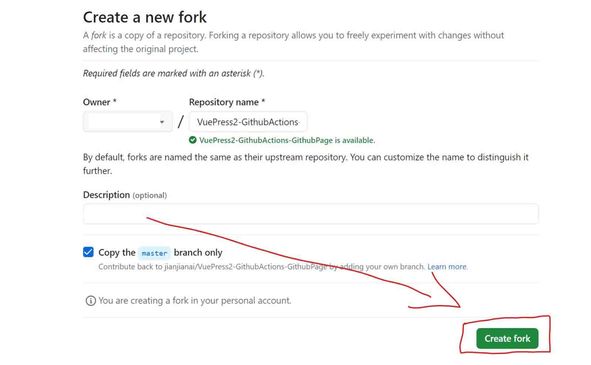
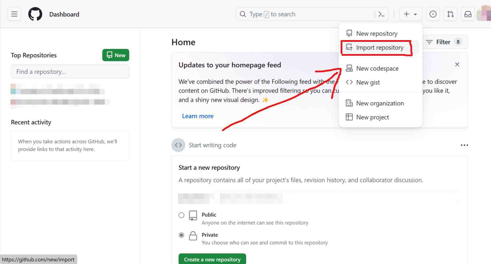
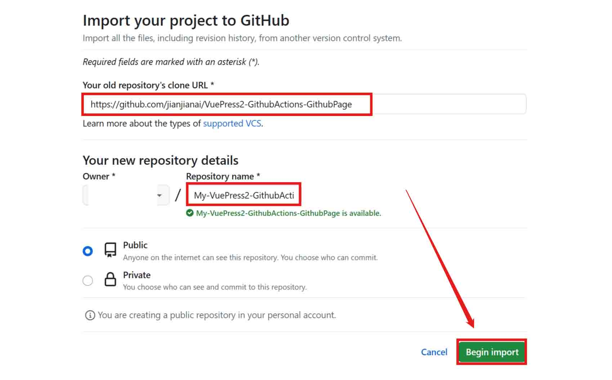

---
# 页面路径
permalinkPattern: 2023/12/4/buildwebsite/

title: 不用花一分钱，免费搭建个人博客。
description: 不用花一分钱，免费搭建属于自己的个人博客。VuePress2 + Github Actions + Github Page + Cloudflare。访问速度快，自定义性强，扩展性好，轻松实现复杂功能。

# 是否在首页展示
# star: true

# 标签
# tags: ["前端"]
sitemap: false


# 启用评论评论
comment: true
---

# 不用花一分钱，免费搭建个人博客。

## 剧情
**这里的内容看不明白没有关系**

毕竟不可能有人跟我一样发了疯似的研究这么多框架和页面生成器。**看看最佳实践**就行了。

### 前言
我一直都想搭建一个自己的个人博客，但是各种云服务器那一个月几十块钱的月租太贵了，
1M的带宽也太小了，升级还得加钱。单纯搭建一个个人博客太不划算了，经过几年的各种研究和尝试，终于找到了免费且还不错的方式搭建个人博客。

### 踩过的坑
我尝试过很多搭建博客的的方式:
- 2020年左右 -> Halo+天翼云搞活动29一年的1h2G1M服务器，因为续费要200多久没续了。
- 2021年左右 -> 尝试过 Nuxt + Netlify 和 Hexo + Netlify，Netlify的速度比较慢，国内有时候无法访问，当初用 Hexo 搭建的网站依旧还摆烂在Netlify上。
- 2023年左右 -> 试着用 Nuxt content + Github Actions + Github Page 搭建博客，然后就弃坑了，感觉Nuxt比较适合写网页应用程序，并不太适合写博客。
- 现在 -> 终于找到了不错的方案 VuePress2 + Github Actions + Github Page + Cloudflare ！

### 最佳实践
-  **VuePress2 + Github Actions + Github Page + Cloudflare 方案**

这套方案是我觉得**文章编辑写最自由**，**主题开发最方便**，**更新自动发布**，**访问速度不错**，**免费**，并且**不用备案**的方案了。


#### 文章编辑写最自由
因为 VuePress2 是使用vue框架的静态网站生成器。
编写文章是所用到的 Markdown 文件会被编译为一个 vue 组件。
这样就可以在 Markdown 文件中编写 vue。 [原神启动](../3-css原神启动效果/原神启动.md)
篇文章的打开动画和交互都使用了这个特性。

#### 主题开发最方便
因为 VuePress2 是使用vue框架的静态网站生成器。
因此主题也是使用vue组件开发，vue有多方便这里就不多赘述了。

#### 更新自动发布
当文章提交到github上时，Github Actions 可以自动运行，生成静态页面，并发发布。

#### 访问速度不错
Github Page 在国内的速度非常慢，经常打不开。但是使用 Cloudflare CDN 进行分发可以完美解决这个问题。
Cloudflare 在国内的使用自己域名的访问速度还是很不错的。

#### 免费
VuePress2 ， Github Actions ， Github Page 和 Cloudflare 都是免费的，如果你已经有自己的域名。
那么无需任何费用。

#### 不用备案
Github Page 和 Cloudflare 均是国外服务商，所以无需备案。只有国内服务商才需要备案。

## 快速开始
这一部分将简单快速得搭建一个和本站差不多的博客网站。

::: tip 小提示
“快速开始”这一部分非常简单，不需要任何代码基础，跟着教程一步一步做即可。
:::

### 创建并打开工作区
安装环境和创建工程需要执行许多命令和创建许和修改许多文件。一不小心就容易出错，为了更轻松地开始，
我已经给大家创建好了[工程和必要的配置文件](https://github.com/jianjianai/VuePress2-GithubActions-GithubPage)，并上传到了GitHub上。

- 使用gitpod在线IDE创建工作区 (新手推荐)
- 使用windows电脑创建工作区


::: tabs#useIDE
@tab 使用gitpod在线IDE
#### 使用gitpod在线IDE
不需要自己配置运行环境，只需一个浏览器即可。新手推荐使用这种方式，可以避免因各种不确定因素引发的问题。

##### 前提
- 会使用一些加速器，例如 **Watt Toolkit**，能够畅通无阻地访问 **GitHub**


@tab 使用windows电脑
#### 使用windows电脑
将在windows电脑上安装必要的环境和VS code编辑器，启动一个工作区。

##### 前提
- 会使用一些加速器，例如 **Watt Toolkit**，能够畅通无阻地访问网速较慢的网站，如 **GitHub**
- 会使用一些代码编辑器，例如 **VS Code**
- 会使用 **cmd** 等命令行工具 , 不需要知道命令如何使用，文章会给出具体命令。

<div>

::: warning 意外情况
可能会出现访问国外服务器缓慢的问题，[**上网](https://cn.bing.com/search?q=%E7%A7%91%E5%AD%A6%E4%B8%8A%E7%BD%91%E6%96%B9%E6%B3%95)即可解决，这里不过多著述，可到互联网上自行学习。
- Github 无法访问或速度缓慢
- git clone 命令无法克隆仓库
- npm install 命令执行失败

</div>

:::


#### 创建新仓库

fork 或 import 选择一种即可。fork只需一步，import需要几步。
::: tabs
@tab fork
1. 登录github
2. 打开仓库链接:[https://github.com/jianjianai/VuePress2-GithubActions-GithubPage/fork](https://github.com/jianjianai/VuePress2-GithubActions-GithubPage/fork)
3. 点击 ```Create fork```




@tab import
1. 登录github
2. 在主页点击```Import repository```

3. 在```Your old repository's clone URL```输入框中输入仓库地址:```https://github.com/jianjianai/VuePress2-GithubActions-GithubPage```
4. 在```Repository name```输入框中给仓库取个名字
5. 点击 ```Begin import`` 按钮


:::


以下内容未完成....
等更新吧。

<!-- ::: tabs#useIDE
@tab 使用gitpod在线IDE

@tab 使用windows电脑

::: -->


