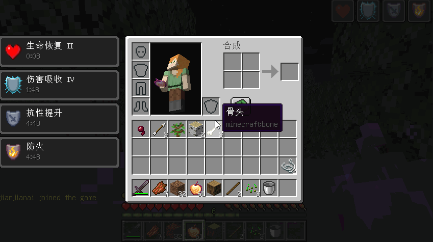
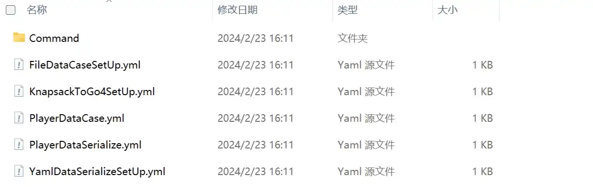
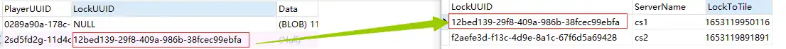

---
# 页面路径
permalinkPattern: 2024/2/23/KnapsackToGo4/

title: KnapsackToGo4:强大的跨服数据同步插件第4代。
description: KTG4是基于bukkitAPI的我的世界服务器跨服同步插件，可在多个服务器之间同步玩家数据，支持多种同步方式。以轻松的完成多服务器之间的数据同步。未来将支持minecraft其他服务端Fabric，forge，sponge，Folia。

# 是否在首页展示
star: true

# 标签
tags: ["mc插件","mc"]

# sitemap 如果为 false 则不写入
# 更新频率 changefreq -> "always" | "hourly" | "daily" | "weekly" | "monthly" | "yearly" | "never"
# 优先级 priority -> 范围 0 至 1。
# sitemap: false
# sitemap:
#     changefreq: monthly
#     priority: 0.5

# 启用评论评论
comment: true
---
<script setup>
import { ref, reactive } from "vue"
const serverName = ref("server1");
const fileFile = ref("C://knapsackToGo4/player");
const sqliteFile = ref("C://knapsackToGo4/playerData.db");
const userName = ref("root");
const passWord = ref("password");
const mysqlAdderss = ref("127.0.0.1");
const mysqlDataBase = ref("KnapsackToGo4");
const ydsu = reactive({
    AdvancementProgress: false,
    EnderChest: true,
    Experience: true,
    FoodLevel: true,
    Health: true,
    Inventory: true,
    Location: false,
    MaxHealth: true,
    PotionEffects: true
})

</script>
<style scoped>
    .lineDiv {
        display: flex;
        flex-direction: row;
        align-items: center;
    }

    @media (max-width:600px) {
        .lineDiv {
            flex-direction: column;
        }
    }
</style>

# KnapsackToGo4
KTG4是基于bukkitAPI的我的世界服务器跨服同步插件，全称KnapsackToGo4。
强大的跨服数据同步插件第4代。
可在多个服务器之间同步玩家数据，支持多种同步方式。
使用KnapsackToGo4可以轻松的完成多服务器之间的数据同步。
未来将支持minecraft其他服务端Fabric，forge，sponge，Folia。
<Demo title="效果演示">
<div class="lineDiv">
<div></div>
<div style="padding: 1rem;">

### KnapsackToGo4的演示
使用KnapsackToGo4可以轻松的完成多服务器之间的数据同步。KnapsackToGo4比KnapsackToGo2更稳定，更轻量，解决了死锁的问题，拥有更多同步方式和更强大的扩展性。

</div>
</div>
</Demo>

## 功能介绍

### 内置数据序列化
- #### yaml (默认)
> bukkit内置的序列化方式，最古老、最稳妥、兼容性最好的方式。几乎所有版本都支持。
- [x] 物品栏
- [x] 装备栏
- [x] 末影箱
- [x] 饱食度
- [x] 生命值
- [x] 最大生命值
- [x] 进度
- [x] 经验值
- [x] 药水效果
- [x] 位置
- [ ] 成书和书与笔中的特殊字符 （直接报错,bukkil里yaml问题，请反馈给服务端，建议禁用成书和书与笔）

### 内置的数据存储方式
- #### File (默认)
> 使用文件来完成数据同步，需要同步的服务器设置相同文件夹。

- #### Sqlite
> 使用Sqlite数据库完成同步，Sqlite是一个文件数据库，需要同步的服务器设置同一个.db文件。性能比文件夹好。

- #### Mysql
> 使用Mysql数据库完成同步，Mysql是一个网络数据库，需要同步的服务器连接到同一个数据库。

::: important 提醒
使用Mysql同步数据，如果玩家数量很多，需要自己使用数据库管理软件立索引，否则会性能降低。
:::


### KnapsackToGo4通过扩展可以支持MOD数据同步

#### ktg4作者编写的扩展下载列表
[https://gitee.com/jja8/KnapsackToGo4Plugin/releases](KnapsackToGo4Plugin)

#### NMSserialize
NMSserialize是KnapsackToGo4的数据序列化扩展，
NMSserialize主要是针对MOD服务器开发的，目前只提供1.12.2，1.16.5和1.18.2这几个MOD较多的版本。

##### 支持情况
- [x] 物品栏
- [x] 装备栏
- [x] 末影箱
- [x] 饱食度
- [x] 生命值
- [x] 最大生命值
- [x] 进度
- [x] 经验值
- [x] 药水效果
- [x] 位置
- [x] 统计数据
- [x] 成书和书与笔中的特殊字符
- [x] 玩家对象上的自定义数据 (mod和插件数据)
- [x] 特殊物品
- [x] 饰品栏

以上是已知，全部完美同步列表。

::: tip 小知识
NMSserialize使用，NMS序列化，直接调用核心序列化玩家数据，可以完美存储几乎所有的数据包括MOD的数据。缺点是必须同步全部数据。
:::

::: important 提醒
如果的服务端是纯净服务端不推荐使用NMSserialize，NMSserialize更新较慢，当你要升级服务器到最新版本时NMSserialize可能还没更新。
:::


### KnapsackToGo4如何保证数据安全
KnapsackToGo4使用的独占锁的方式，当玩家在一个服务器中的时其他服务器无法读取。
<Demo title="效果演示">


</Demo>


### 为什么写这款插件
> KnapsackToGo2插件已经有很多服务器在使用了，并且功能也挺完善。 但是仍然存在一些问题，例如：服务器崩溃后玩家再次进入服务器就需要等待许久。 
> 我自己对KnapsackToGo2也是不意的， 在开发完KnapsackToGo2之后我又继续开发了许多插件，也学习到了很多编程经验，我感觉我的编程技术有了很大的进步。 
> 在总结了前几代插件的毛病和逻辑上的问题后，我想到了种新的方案。于是我决定重新编写了一个更好的KnapsackToGo4。 
> 这次全新的KnapsackToGo4是在总结了前面所有经验后完全重新编写的，运行逻辑也是最合理符合直觉的。

> ps： 为什么新一代叫KnapsackToGo4而不是KnapsackToGo3呢? 因为KnapsackToGo3在很久之前就写完了，但是因为问题太多所以就弃坑了。


## 下载订阅
<Demo title="插件实验室交流频道">
<div class="lineDiv">
<div></div>
<div style="padding: 1rem;">

### PlugClub / 插件实验室
加入我们的插件社区，交流和插件的使用方法，反馈遇到的问题，获得最新动态。

qq群：820131534 (已满)

因为qq群满了，所以现在有了qq频道: [https://pd.qq.com/s/113phvpau](https://pd.qq.com/s/113phvpau)

</div>
</div>
</Demo>

<Demo title="gitee开源社区">
<div class="lineDiv">
<div></div>
<div style="padding: 1rem;">

### gitee开源社区
在发行版中下载最新版插件：[https://gitee.com/jja8/KnapsackToGo4/releases](https://gitee.com/jja8/KnapsackToGo4/releases)

提交issues，反馈使用中遇到的问题：[https://gitee.com/jja8/KnapsackToGo4/issues](https://gitee.com/jja8/KnapsackToGo4/issues)

</div>
</div>
</Demo>

<Demo title="github开源社区">
<div class="lineDiv">
<div><svg aria-hidden="true" viewBox="0 0 16 16" version="1.1" width="100%" data-view-component="true" class="octicon octicon-mark-github v-align-middle color-fg-default">
    <path d="M8 0c4.42 0 8 3.58 8 8a8.013 8.013 0 0 1-5.45 7.59c-.4.08-.55-.17-.55-.38 0-.27.01-1.13.01-2.2 0-.75-.25-1.23-.54-1.48 1.78-.2 3.65-.88 3.65-3.95 0-.88-.31-1.59-.82-2.15.08-.2.36-1.02-.08-2.12 0 0-.67-.22-2.2.82-.64-.18-1.32-.27-2-.27-.68 0-1.36.09-2 .27-1.53-1.03-2.2-.82-2.2-.82-.44 1.1-.16 1.92-.08 2.12-.51.56-.82 1.28-.82 2.15 0 3.06 1.86 3.75 3.64 3.95-.23.2-.44.55-.51 1.07-.46.21-1.61.55-2.33-.66-.15-.24-.6-.83-1.23-.82-.67.01-.27.38.01.53.34.19.73.9.82 1.13.16.45.68 1.31 2.69.94 0 .67.01 1.3.01 1.49 0 .21-.15.45-.55.38A7.995 7.995 0 0 1 0 8c0-4.42 3.58-8 8-8Z"></path>
</svg></div>
<div style="padding: 1rem;">

### github开源社区
在发行版中下载最新版插件：[https://github.com/jianjianai/KnapsackToGo4/releases](https://github.com/jianjianai/KnapsackToGo4/releases)

提交issues，反馈使用中遇到的问题：[https://github.com/jianjianai/KnapsackToGo4/issues](https://github.com/jianjianai/KnapsackToGo4/issues)

</div>
</div>
</Demo>

<Demo title="spigot">
<div class="lineDiv">
<div></div>
<div style="padding: 1rem;">

### spigot
在spigot上下载：[https://www.spigotmc.org/resources/knapsacktogo4-powerful-cross-server-data-synchronization-plug-in-generation-4.102493/](https://www.spigotmc.org/resources/knapsacktogo4-powerful-cross-server-data-synchronization-plug-in-generation-4.102493/)

</div>
</div>
</Demo>


## 详细教程

### 快速完成配置
首先下载最新版KnapsackToGo4放到服务器的plugins文件夹，启动服务器，插件会在plugins文件夹下的KnapsackToGo4目录中创建默认配置。之后关闭服务器，打开KnapsackToGo4文件夹。


#### 配置数据容器（同步方式）
数据容器是存储数据的方式。用来存数据。比如记录文字可以用纸和笔，也可以用电脑或手机，还可以刻在石头上。
在这里可以配置数据用什么方式来存储，插件内置了3种数据容器，分别是 ```File```,```Sqlite```,```Mysql```。

::: tabs#case
@tab File
使用文件来完成数据同步，需要同步的服务器设置相同文件夹。

@tab Sqlite
使用Sqlite数据库完成同步，Sqlite是一个文件数据库，需要同步的服务器设置同一个.db文件。性能比文件夹好。

@tab Mysql
使用Mysql数据库完成同步，Mysql是一个网络数据库，需要同步的服务器连接到同一个数据库。
:::

##### 1.修改PlayerDataCase.yaml
修改```PlayerDataCase.yml```文件来配置数据同步方式。

::: tabs#case
@tab File
修改：**PlayerDataCase.yml**
``` yaml
playerDataCaseType: File

```

@tab Sqlite
修改：**PlayerDataCase.yml**
``` yaml
playerDataCaseType: Sqlite

```

@tab Mysql
修改：**PlayerDataCase.yml**
``` yaml
playerDataCaseType: Mysql

```
:::
之后重启一下服务器，插件会自动释放对应数据容器的默认配置文件。

##### 2.修改对应容器的配置文件

::: tabs#case
@tab File
修改：**FileDataCaseSetUp.yml**
<pre class="language-yaml">
file: {{fileFile}}
serverName: {{serverName}}

</pre>
调整配置:
<table style="width: 100%;">
    <tr style="display: flex;">
        <td style="width: 6rem;">服务器名称：</td>
        <td style="flex: 1;"><input type="text" v-model="serverName" style="width: 100%;"></td>
    </tr>
    <tr style="display: flex;">
        <td  style="width: 6rem;">文件夹位置：</td>
        <td style="flex: 1;"><input type="text" v-model="fileFile" style="width: 100%;"></td>
    </tr>
</table>


@tab Sqlite
修改：**SqliteDataCaseSetUp.yml**
<pre class="language-yaml">
PassWord: {{passWord}}
dataBaseURL: jdbc:sqlite:{{sqliteFile}}
holdLockTime: 30000
serverName: {{serverName}}
userName: {{userName}}

</pre>
调整配置:
<table style="width: 100%;">
    <tr style="display: flex;">
        <td style="width: 6rem;">服务器名称：</td>
        <td style="flex: 1;"><input type="text" v-model="serverName" style="width: 100%;"></td>
    </tr>
    <tr style="display: flex;">
        <td  style="width: 6rem;">文件位置：</td>
        <td style="flex: 1;"><input type="text" v-model="sqliteFile" style="width: 100%;"></td>
    </tr>
    <tr style="display: flex;">
        <td  style="width: 6rem;">用户名：</td>
        <td style="flex: 1;"><input type="text" v-model="userName" style="width: 100%;"></td>
    </tr>
    <tr style="display: flex;">
        <td  style="width: 6rem;">密码：</td>
        <td style="flex: 1;"><input type="text" v-model="passWord" style="width: 100%;"></td>
    </tr>
</table>

@tab Mysql
修改：**PlayerDataCase.yml**
<pre class="language-yaml">
PassWord: {{passWord}}
dataBaseURL: jdbc:mysql://{{mysqlAdderss}}/{{mysqlDataBase}}
holdLockTime: 30000
serverName: {{serverName}}
userName: {{userName}}

</pre>
调整配置:
<table style="width: 100%;">
    <tr style="display: flex;">
        <td style="width: 6rem;">服务器名称：</td>
        <td style="flex: 1;"><input type="text" v-model="serverName" style="width: 100%;"></td>
    </tr>
    <tr style="display: flex;">
        <td  style="width: 6rem;">数据库地址：</td>
        <td style="flex: 1;"><input type="text" v-model="mysqlAdderss" style="width: 100%;"></td>
    </tr>
    <tr style="display: flex;">
        <td  style="width: 6rem;">数据库名称：</td>
        <td style="flex: 1;"><input type="text" v-model="mysqlDataBase" style="width: 100%;"></td>
    </tr>
    <tr style="display: flex;">
        <td  style="width: 6rem;">用户名：</td>
        <td style="flex: 1;"><input type="text" v-model="userName" style="width: 100%;"></td>
    </tr>
    <tr style="display: flex;">
        <td  style="width: 6rem;">密码：</td>
        <td style="flex: 1;"><input type="text" v-model="passWord" style="width: 100%;"></td>
    </tr>
</table>
:::

完成配置后重启服务器，如果配置正确，那么插件不会有任何报错，之后将配置文件复制到其他需要同步的服务器上就可以啦！
::: tip 提示 关于serverName
```serverName(服务器名称)```建议每个服务器都不相同，当然都相同也不会影响插件正常运行，但是当需要查看日志的时候会分不清服务器。
:::

::: tip 提示 配置文件太多分不清
配置文件夹中有很多文件其实都是无用配置文件，如果你使用Mysql那么FileDataCaseSetUp.yml和SqliteDataCaseSetUp.yml就可以删掉啦！只用管MysqlDataCaseSetUp.yml就可以了，插件也不会自动生成不需要的配置文件。
:::


#### 配置序列化方法（数据的表达方式）
序列化方法是数据的表达方式，比如你可以用汉语表达信息，也可以用英语表达信息。
目前插件只内置一种序列化方法```Yaml```，所以一般无需配置，保持默认即可。

::: tabs#syn

@tab Yaml
Yaml是bukkit内置的序列化方式，最古老、最稳妥、兼容性最好的方式。几乎所有版本都支持。

:::

##### 1.修改PlayerDataSerialize.yml

::: tabs#syn
@tab Yaml
修改：**PlayerDataSerialize.yml**
``` yaml
playerDataSerializeType: Yaml

```
:::
之后重启服务器，插件会自动生成对应的序列化方法配置文件。

::: tabs#syn
@tab Yaml
修改：**YamlDataSerializeSetUp.yml**
<pre class="language-yaml">
AdvancementProgress: {{ydsu.AdvancementProgress}}
EnderChest: {{ydsu.EnderChest}}
Experience: {{ydsu.Experience}}
FoodLevel: {{ydsu.FoodLevel}}
Health: {{ydsu.Health}}
Inventory: {{ydsu.Inventory}}
Location: {{ydsu.Location}}
MaxHealth: {{ydsu.MaxHealth}}
PotionEffects: {{ydsu.PotionEffects}}

</pre>
**打开或关闭同步功能（一件修改上方配置文件）** 
<table>
    <tr>
        <td>物品栏</td>
        <td><input type="checkbox" v-model="ydsu.Inventory"></td>
    </tr>
    <tr>
        <td>末影箱</td>
        <td><input type="checkbox" v-model="ydsu.EnderChest"></td>
    </tr>
    <tr>
        <td>经验值</td>
        <td><input type="checkbox" v-model="ydsu.Experience"></td>
    </tr>
    <tr>
        <td>饱食度</td>
        <td><input type="checkbox" v-model="ydsu.FoodLevel"></td>
    </tr>
    <tr>
        <td>生命值</td>
        <td><input type="checkbox" v-model="ydsu.Health"></td>
    </tr>
    <tr>
        <td>最大生命值</td>
        <td><input type="checkbox" v-model="ydsu.MaxHealth"></td>
    </tr>
    <tr>
        <td>药水效果</td>
        <td><input type="checkbox" v-model="ydsu.PotionEffects"></td>
    </tr>
    <tr>
        <td>进度</td>
        <td><input type="checkbox" v-model="ydsu.AdvancementProgress"></td>
    </tr>
    <tr>
        <td>位置</td>
        <td><input type="checkbox" v-model="ydsu.Location"></td>
    </tr>
</table>
:::
之后将配置文件复制到全部服务器，重启后即可应用设置。

### 插件工作原理
以后再更新吧...

### 开发者API
以后再更新吧...


## 常见问题解答
### 一直显示数据似乎出错了,请联系管理员恢复数据
isDataError: 数据似乎出错了,请联系管理员恢复数据..<数>

#### 产生原因
玩家存储在数据库中的数据损坏了。

#### 解决方法
如果有备份数据库可以还原之前的备份，如果没有备份可以使用命令CancelError，放弃数据库中的数据，使用当前服务器的旧数据。

让玩家进入最后一次退出的服务器然后使用CancelError命令，可以保证数据不会丢失或回档。

### 一直显示正在加载数据，并且读数。
2022.07.19.0949版本之前提示消息是：正在加载你的数据,请稍等...

2022.07.19.0949版本之后提示消息是：等待其他服务器保存数据...

#### 产生原因
为了保证数据安全，一个玩家的数据在同一时间只允许被一个服务器加载。
服务器在加载数据之后会给这个数据打上一个标记，
当其他服务器读取这个数据的时候如果发现存在这个标记就会等待，
直到标记被清除后才会读取。

#### 解决方法
这个问题通常只有在保存数据时发生错误才会产生，如果是使用文件，或者是sqlite这种本地数据库，发生概率非常小。
就算是使用mysql只要网络连接良好，通常也不会产生此问题。

**如果你的服务器上发生了此问题，请一定要保留日志并提交给我。在后续的更新中或许此问题将不会存在了。**

注意：在处理问题之前需要先确认玩家是否同登录两个相同的账号连接不同的两个服务器，如果是这种情况，那就是正常的无需处理。


##### 使用file数据容器的解决方法
file数据容器，是使用操作系统的文件锁。在数据被锁时会生成两个锁文件，分别是<玩家uuid>.lock,<玩家uuid>.lock.inf.

<玩家uuid>.lock是锁标记文件

<玩家uuid>.lock.inf是锁信息

如果你在FileDataCaseSetUp.yaml中设置了每个服务器的serverName那么排查起来就相当方便了。
你可以用记事本打开<玩家uuid>.lock.inf就可以看到是哪个服务器锁定了这个玩家数据，只需重启这个服务器即可。
如果你所有服务器都是默认值null那么请重启所有服务器吧！


##### 使用mysql或者sqlite数据库的解决方法
数据库使用的是关系方式加锁，数据库中有两个表分别是playerdata和lockserver。

服务器会在启动时在lockserver里添加一条随机的LockUUID，关闭时删除这条LockUUID。如果你发现lockserver中的信息条数多于在线服务器数量，那么说明你服务器非正常关闭了，导致锁残留在表里。你可以在所有服务器都关闭的情况下清空这个表。

lockserver中的LockToTime是锁到期时间，在线的服务器会在到期之前自动续期。如果时间到期就会认为此锁已经失效。

playerdata的LockUUID是指向lockserver的LockUUID的，如下图所示。


如果你在mysqlCaseSetUp.yaml中或sqliteCaseSetUp.yaml设置了每个服务器的serverName那么，这样就可以找到玩家是被什么服务器锁了。

如果确定了这个玩家没有在这个服务器中，只用修改这个玩家的LockUUID为”NULL“即可为这个玩家解锁。或者重启持有这个玩家锁的服务器。


