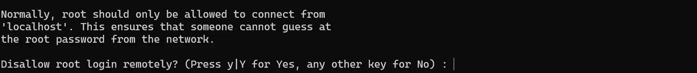
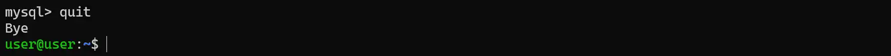
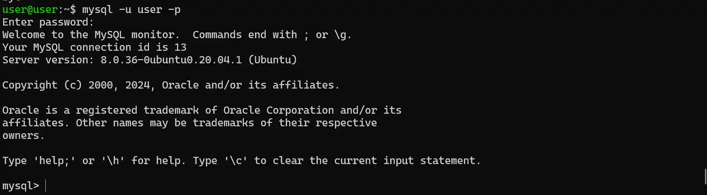
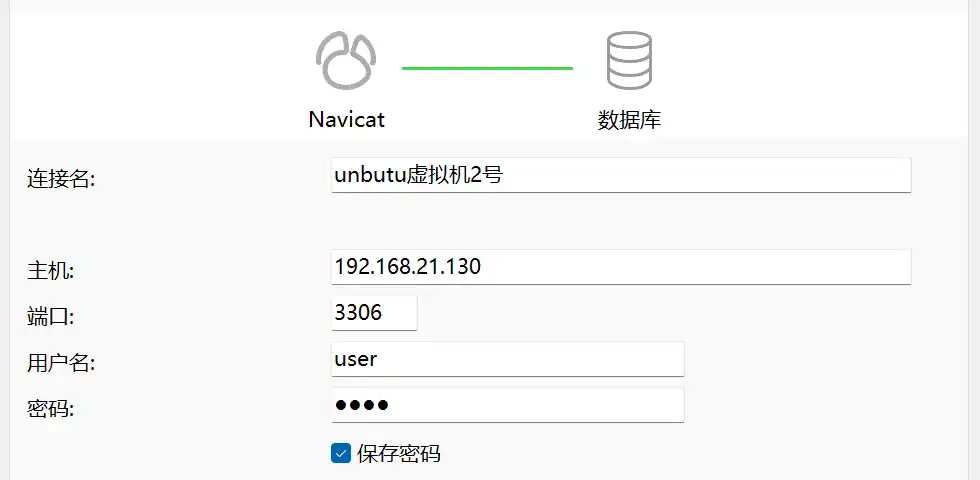
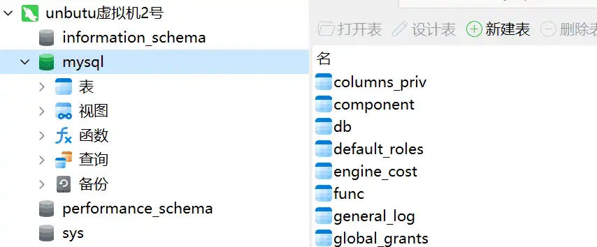

---
# 页面路径
permalinkPattern: 2024/3/6/ubuntu-mysql/

title: Ubuntu Linux下MySQL 8.0的安装与远程用户配置教程
description: 本教程将指导您在Ubuntu Linux系统中安装MySQL 8.0，并展示如何创建新用户、设置远程连接、绑定IP地址与端口，以实现安全的远程访问。
tags: ["后端"]
star: true

# 启用评论评论
comment: true
---

# ubuntu安装并配置mysql80远程连接

## 1.安装mysql

``` shell
sudo apt install mysql-server -y
```

## 2.初始化

``` shell
sudo mysql_secure_installation
```
执行此命令，开始初始化数据库。


>
>
>是否使用密码检查，开启这个会要求使用强密码，一般不开。
>输入:n


>
>
>是否删除匿名用户
>输入:y


>
>
>是否禁止root用户远程登录，看情况开。这里选择开启。
>输入:y


>
>
>是否删除测试数据库，一般都删除。
>输入:y


>
>
>是否立即重新加载权限表
>输入:y

之后初始化就完成了。


## 3.添加一个新用户

### 1.用root用户连接

``` shell
sudo mysql
```
>
>
>这样就是连接成功了。

### 2.创建一个新用户
``` sql
CREATE USER `用户名`@`%` IDENTIFIED BY '密码';
```
- 把```用户名```换成你想用的用户名。
- 把```密码```换成你想用的密码。
- 把```%```换成允许连接的地址，例如`127.0.0.1`就行只允许本地连接，`192.168.1.%`就是只允许192.168.1.x局域网连接。

>
>
>这样就是执行成功，我这里用户名是user密码是root

### 3.给这个用户全部权限
``` sql
GRANT ALL ON *.* TO `用户名`@`%`;
```
创建用户时和给权限时``` `用户名`@`%` ```要一样，不然会出错。

>
>
>这样就是执行成功。

### 4.断开当前连接
``` sql
quit
```

>
>
>这样就是断开连接了

### 4.测试用户是否可以连接
``` shell
mysql -u 用户名 -p
```
- ```用户名```换成你的用户名

>
>
>当显示输入密码时，按键盘看似没有反应其实已经输入了，只是不显示而已，输入完成回车，和我显示一样表示成功。

## 3.更换绑定ip和端口

### 1.修改配置文件
mysql默认绑定ip是```127.0.0.1```，外部是无法连接的，需要修改配置文件设为```0.0.0.0```绑定到全部ip上，外部才能连接。

使用vim编辑器打开mysql配置文件。
``` shell
sudo vim /etc/mysql/mysql.conf.d/mysqld.cnf
```
向下翻，找到```bind-address```项，将```127.0.0.1```改为```0.0.0.0```，保存并退出。


>
>
>像这样就行了。

如果不会使用vim编辑器，请参考这篇文章：[vim编辑器指南](#)

### 2.重启mysql服务
``` shell
sudo service mysql restart
```
执行一下就行了，这条命令没有任何输出。

## 4.在外部连接

### 1.查看服务器ip地址
``` shell
ip address
```


可以看到我的服务器上有三张网卡，分别都有自己的ip地址，我服务器的出口ip是```192.168.21.130``,具体用哪一个根据具体情况而定。


如果不会ip地址相关知识，请参考这篇文章：[ipv4/ipv6深度指南](#)

### 2.使用其他软件连接

我这里就用Navicat了，其他软件都差不多。

>
>
>输入对应的ip地址，端口，用户名，密码就可以连接了。
>
>


